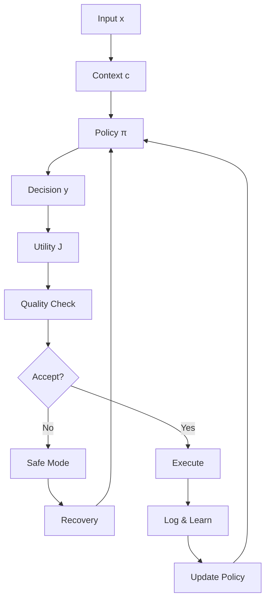

# GIOS Technical Architecture Guide
## Goal-Integrated Operating System for Reasoning and Execution

**Version:** 1.0  
**Author:** Mikhail Nazarenko  
**Date:** 2025-01-15  
**Status:** Technical Specification  

---

## Table of Contents

1. [Executive Summary](#executive-summary)
2. [Core Architecture Overview](#core-architecture-overview)
3. [Mathematical Foundations](#mathematical-foundations)
4. [Component Deep Dive](#component-deep-dive)
5. [Runtime Operations](#runtime-operations)
6. [Quality Assurance Framework](#quality-assurance-framework)
7. [Evolution and Adaptation](#evolution-and-adaptation)
8. [Implementation Guidelines](#implementation-guidelines)
9. [Performance Metrics](#performance-metrics)
10. [Troubleshooting Guide](#troubleshooting-guide)

---

## Executive Summary

GIOS (Goal-Integrated Operating System) is a formalized framework for structuring reasoning and execution in intelligent systems. It provides a mathematical foundation for goal-oriented control, context management, utility optimization, and evolutionary stability.

### Key Design Principles

1. **Goal-Oriented Control**: All operations are directed toward achieving specific objectives
2. **Context Isolation**: Information is organized in isolated "rooms" (contexts) to prevent interference
3. **Utility Optimization**: System behavior is optimized for maximum expected utility
4. **Evolutionary Stability**: The system can adapt while maintaining structural integrity
5. **Quality Assurance**: Built-in mechanisms ensure system reliability and correctness

### Why This Architecture?

Traditional approaches to intelligent systems suffer from:
- **Fragmentation**: Different components operate in isolation
- **Inconsistency**: No unified framework for decision-making
- **Instability**: Systems break down under complex conditions
- **Unpredictability**: Behavior becomes erratic as complexity grows

GIOS solves these problems through:
- **Unified Framework**: Single mathematical model for all operations
- **Structured Contexts**: Clear boundaries and relationships
- **Optimization Constraints**: Guaranteed performance bounds
- **Evolutionary Robustness**: Stable adaptation mechanisms

---

## Core Architecture Overview

### System Components



### Core Mathematical Model

The entire GIOS system is built around a single optimization objective:

```
max_{a∈A, π∈Π} E[J(π(x,c))] - λ_read * Read(a)
subject to: WF_PartE = 1, WF_PartF = 1, WF_G = 1
```

**What this means:**
- **E[J(π(x,c))]**: Expected utility of policy π given input x in context c
- **λ_read * Read(a)**: Cost of reading artifact a (penalty for complexity)
- **WF_PartE, WF_PartF, WF_G**: Well-formedness constraints ensuring system integrity

---

## Mathematical Foundations

### 1. Context and Artifact Management

#### Contexts (Rooms)
```math
C = {c₁, c₂, ..., cₙ}  // Set of all contexts
c(a) ⊆ C              // Artifact a belongs to contexts c(a)
```

**Why contexts?**
- **Isolation**: Prevents information leakage between different domains
- **Modularity**: Each context can evolve independently
- **Security**: Access control is context-based
- **Scalability**: System can handle unlimited contexts

#### Artifacts
```math
a ∈ A  // Artifact (any piece of information)
Read(a) = cost of reading artifact a
```

**Artifact types:**
- **Data**: Raw information
- **Policies**: Decision rules
- **Models**: Predictive functions
- **Constraints**: System limitations

### 2. Policy and Decision Making

#### Policy Definition
```math
π: X × C → Δ(Y)  // Policy maps (input, context) to probability distribution over actions
```

**Policy components:**
- **Input Space X**: All possible inputs
- **Context Space C**: All possible contexts
- **Action Space Y**: All possible actions
- **Probability Distribution Δ(Y)**: Uncertainty handling

#### Decision Process
```math
y ~ π(·|x,c)  // Sample action y from policy π given input x in context c
```

**Why probabilistic?**
- **Uncertainty**: Real-world decisions involve uncertainty
- **Exploration**: System can try different approaches
- **Robustness**: Handles unexpected situations gracefully

### 3. Utility and Optimization

#### Utility Function
```math
J(π(x,c)) = utility of action π(x,c)
E[J] = expected utility over all possible outcomes
```

**Utility components:**
- **Immediate Reward**: Direct benefit of action
- **Future Value**: Long-term consequences
- **Risk Adjustment**: Penalty for uncertainty
- **Resource Cost**: Cost of execution

#### Optimization Constraints
```math
WF_PartE = 1  // Structural integrity
WF_PartF = 1  // Domain coverage
WF_G = 1      // Glossary completeness
```

**Why constraints?**
- **Safety**: Prevents system from breaking
- **Completeness**: Ensures all domains are covered
- **Consistency**: Maintains logical coherence
- **Traceability**: Enables debugging and auditing

---

## Component Deep Dive

### 1. Well-Formedness Part E (Structural Integrity)

#### E.1: DevOps Lexical Firewall
```math
WF_E.1(a) = 1[∀t ∈ L_ban: freq_a(t) = 0]
```

**Purpose**: Prevents banned terms from appearing in artifacts
**Why needed**: Ensures professional language and avoids problematic terminology
**Implementation**: Regular expression filtering on all text content

#### E.2: Notational Independence
```math
∀a, ∀f₁,f₂: Render(a,f₁) ≡ Render(a,f₂) ⇒ Sem(Render(a,f₁)) = Sem(Render(a,f₂))
```

**Purpose**: Ensures semantic consistency across different notations
**Why needed**: Different tools may use different syntax but should mean the same thing
**Implementation**: Semantic equivalence testing between different renderers

#### E.3: Unidirectional Dependencies
```math
WF_E.3 = 1[dependency graph on families is DAG]
```

**Purpose**: Prevents circular dependencies
**Why needed**: Circular dependencies cause infinite loops and system instability
**Implementation**: Topological sorting of dependency graph

#### E.4: Cross-Domain Bias Audit
```math
BiasIndex = Σ_g w_g |Pr(ŷ=1|g) - Pr(ŷ=1)| ≤ β_max
```

**Purpose**: Ensures fairness across different groups
**Why needed**: Prevents discrimination and ensures equal treatment
**Implementation**: Statistical analysis of decision outcomes by group

#### E.5: DRR Process and No-Loss Trace
```math
trace_→: A → A, trace_←: A → A
NoLoss_Audit = 1 ⇔ ∀a ∃a': trace_→(a) = a' ∧ trace_←(a') = a
```

**Purpose**: Ensures complete traceability of changes
**Why needed**: Enables rollback and debugging
**Implementation**: Bidirectional mapping between artifact versions

### 2. Well-Formedness Part F (Domain Coverage)

#### Domain Coverage and Acyclicity
```math
1[∪ᵢ₌₁ᴺ scope_i = TargetDomain] ∧ 1[DAG(v_i)] = 1
```

**Purpose**: Ensures complete domain coverage without cycles
**Why needed**: System must handle all relevant domains without getting stuck
**Implementation**: Domain mapping and cycle detection algorithms

#### Cluster Cohesion and Purity
```math
∀s ∀t,t' ∈ cluster(s): sim(t,t') ≥ θ
1[K_c does not intersect other clusters] = 1
```

**Purpose**: Ensures related concepts are grouped together
**Why needed**: Improves system understanding and reduces confusion
**Implementation**: Clustering algorithms with similarity thresholds

#### Link Budget and Growth Control
```math
Σ_links CL ≤ ζ_max
ExplodeIndex = (#NewRows + #NewTemplates)/(#ReusedRows + 1) ≤ ξ_max
```

**Purpose**: Controls system complexity and growth
**Why needed**: Prevents system from becoming too complex to understand
**Implementation**: Cost tracking and growth rate monitoring

### 3. Well-Formedness Part G (Glossary Completeness)

#### Glossary Completeness
```math
Glossary = {Entry(u) | u ∈ U}, |Glossary| = |U|
```

**Purpose**: Ensures all concepts have definitions
**Why needed**: Enables clear communication and understanding
**Implementation**: Automated glossary generation and validation

#### Bidirectional Navigation
```math
WF_G = 1[Glossary holds] ∧ 1[maps are bidirectional and transitively navigable]
```

**Purpose**: Enables navigation between related concepts
**Why needed**: Helps users understand relationships between concepts
**Implementation**: Graph-based navigation system

---

## Runtime Operations

### 1. Runtime Loop

The core runtime loop operates as follows:

```math
At step t:
1. Observe o_t
2. Pick y_t ~ π(·|o_t, c)
3. Apply y_t
4. Log (o_t, y_t, c)
5. Terminate if U_t < U_min or enter safe mode
```

**Step-by-step explanation:**
1. **Observe**: System receives input from environment
2. **Pick**: Policy selects action based on input and context
3. **Apply**: Action is executed in the environment
4. **Log**: All actions are recorded for analysis
5. **Terminate/Safe**: System stops if utility drops too low

### 2. Safe Mode Automaton

```math
s_{t+1} = {
  SAFE    if U_t < U_min ∨ ErrRate_t > ε_max
  RECOVER if s_t = SAFE ∧ ErrRate_t ≤ ε_max ∧ (t - t_SAFE) ≥ h
  RUN     otherwise
}
```

**States:**
- **RUN**: Normal operation
- **SAFE**: Error detected, system paused
- **RECOVER**: Attempting to recover from error

**Why safe mode?**
- **Error Handling**: Prevents system from making more errors
- **Recovery Time**: Gives system time to analyze and fix problems
- **Stability**: Ensures system can recover from failures

### 3. Role-Based Access Control

```math
Perm(u,c) = 1 ⇔ R_{u,c} = 1
MayEdit(a,c) = 1 ⇔ Perm(own(a), c) = 1 ∧ c ∈ c(a)
```

**Components:**
- **u**: User/agent
- **c**: Context/room
- **R**: Permission matrix
- **a**: Artifact

**Why role-based?**
- **Security**: Prevents unauthorized access
- **Modularity**: Different users have different permissions
- **Auditability**: Clear record of who can do what

---

## Quality Assurance Framework

### 1. Acceptance Gates

#### E/F/G Acceptance
```math
ACCEPT_E = 1[WF_PartE = 1] ∧ 1[E[J] non-decreasing]
ACCEPT_F = 1[WF_PartF = 1] ∧ 1[Σ CL ≤ ζ_max] ∧ 1[ExplodeIndex ≤ ξ_max]
ACCEPT_G = 1[WF_G = 1] ∧ 1[all u ∈ U catalogued] ∧ 1[maps bidirectional]
```

**Purpose**: Ensures system meets quality standards
**Why needed**: Prevents deployment of broken systems
**Implementation**: Automated testing and validation

#### Unified Acceptance Gate
```math
ACCEPT_OS = 1 ⇔ ACCEPT_E = 1 ∧ ACCEPT_F = 1 ∧ ACCEPT_G = 1 ∧ RB_Test = 1 ∧ EVO_ROB = 1 ∧ E[J] ≥ U_min
```

**Purpose**: Single gate for all quality checks
**Why needed**: Simplifies deployment process
**Implementation**: Comprehensive validation pipeline

### 2. Quality Metrics

#### Standard Metrics
```math
Acc = (TP + TN)/T
Prec = TP/(TP + FP)
Rec = TP/P
F1 = 2*TP/(2*TP + FP + FN)
Spec = TN/N
FPR = FP/N
FNR = FN/P
```

**Metrics explained:**
- **Accuracy (Acc)**: Overall correctness
- **Precision (Prec)**: Correctness of positive predictions
- **Recall (Rec)**: Coverage of positive cases
- **F1**: Harmonic mean of precision and recall
- **Specificity (Spec)**: Correctness of negative predictions
- **False Positive Rate (FPR)**: Rate of false alarms
- **False Negative Rate (FNR)**: Rate of missed cases

#### Thresholds
```math
Acc ≥ 0.985, Prec ≥ 0.980, Rec ≥ 0.975, F1 ≥ 0.977
Spec ≥ 0.990, FPR ≤ 0.010, FNR ≤ 0.025
```

**Why these thresholds?**
- **High Accuracy**: System must be very reliable
- **Low False Positives**: Minimize false alarms
- **Low False Negatives**: Minimize missed cases
- **Balanced Performance**: All metrics must be good

### 3. Fuzzy Quality Aggregation

```math
U_fuzzy = Σ_i ν_i μ_i(m_i)
```

**Components:**
- **m_i**: Individual metric values
- **μ_i**: Membership functions (0 to 1)
- **ν_i**: Normalized weights (sum to 1)

**Why fuzzy aggregation?**
- **Uncertainty**: Real-world metrics are imprecise
- **Flexibility**: Different metrics can have different importance
- **Robustness**: System works even with imperfect measurements

---

## Evolution and Adaptation

### 1. Strategic Evolution

```math
κ_{t+1} = T(κ_t, δ_t)
κ_t ∈ K, δ_t ∈ D_adm
```

**Components:**
- **κ_t**: Architecture configuration at time t
- **δ_t**: Admissible change at time t
- **T**: Transition function

**Why evolution?**
- **Adaptation**: System must adapt to changing requirements
- **Improvement**: System should get better over time
- **Resilience**: System must handle unexpected changes

### 2. Evolutionary Robustness

```math
EVO_ROB = 1[∀δ ∈ D_adm: E[J(κ_{t+1})] ≥ E[J(κ_t)] - ε_evo ∧ WF_PartE = WF_PartF = WF_G = 1]
```

**Purpose**: Ensures evolution doesn't break the system
**Why needed**: Prevents system degradation during evolution
**Implementation**: Constraint checking during evolution

### 3. Composition Operators

#### Method Composition
```math
Γ_method: M₂ ∘ M₁, M₁ ∥ M₂
1[boundaries aligned] = 1
```

**Types:**
- **Sequential (∘)**: M₂ after M₁
- **Parallel (∥)**: M₁ and M₂ simultaneously

**Why composition?**
- **Modularity**: Break complex operations into simpler parts
- **Reusability**: Use same methods in different contexts
- **Efficiency**: Parallel execution where possible

#### Work Aggregation
```math
Γ_work: Σ consume
1[budgets additive] = 1
```

**Purpose**: Combines work from multiple sources
**Why needed**: Enables distributed processing
**Implementation**: Resource pooling and allocation

---

## Implementation Guidelines

### 1. System Architecture

#### Core Components
1. **Context Manager**: Manages contexts and their relationships
2. **Policy Engine**: Executes policies and makes decisions
3. **Utility Calculator**: Computes utility and optimization metrics
4. **Quality Monitor**: Tracks quality metrics and triggers safe mode
5. **Evolution Engine**: Manages system evolution and adaptation

#### Data Structures
```python
class Context:
    id: str
    artifacts: Set[Artifact]
    policies: Set[Policy]
    permissions: Dict[Agent, bool]

class Artifact:
    id: str
    content: Any
    contexts: Set[Context]
    owner: Agent
    read_cost: float

class Policy:
    id: str
    function: Callable[[Input, Context], Action]
    contexts: Set[Context]
    utility: float
```

### 2. Implementation Phases

#### Phase 1: Core Framework
1. Implement basic context and artifact management
2. Create simple policy engine
3. Add basic utility calculation
4. Implement logging and monitoring

#### Phase 2: Quality Assurance
1. Add well-formedness checks
2. Implement acceptance gates
3. Create quality metrics tracking
4. Add safe mode functionality

#### Phase 3: Evolution and Adaptation
1. Implement evolution engine
2. Add composition operators
3. Create adaptation mechanisms
4. Add robustness checks

#### Phase 4: Optimization and Performance
1. Optimize runtime performance
2. Add caching and memoization
3. Implement parallel processing
4. Add performance monitoring

### 3. Testing Strategy

#### Unit Tests
- Test individual components in isolation
- Verify mathematical correctness
- Check edge cases and error conditions

#### Integration Tests
- Test component interactions
- Verify data flow between components
- Check system behavior under load

#### System Tests
- Test complete system functionality
- Verify quality metrics and thresholds
- Check evolution and adaptation

#### Performance Tests
- Measure runtime performance
- Test scalability and resource usage
- Verify optimization effectiveness

---

## Performance Metrics

### 1. Runtime Performance

#### Latency
```math
Latency ≤ ℓ_max
Latency_p99 ≤ ℓ_max^99
```

**Measurement**: Time from input to output
**Target**: < 100ms for 95% of requests, < 500ms for 99%

#### Throughput
```math
Throughput ≥ τ_min
```

**Measurement**: Requests processed per second
**Target**: > 1000 requests/second

#### Error Rate
```math
ErrRate ≤ ε_max
```

**Measurement**: Percentage of failed requests
**Target**: < 1% error rate

### 2. Quality Performance

#### Accuracy Metrics
- **Overall Accuracy**: > 98.5%
- **Precision**: > 98.0%
- **Recall**: > 97.5%
- **F1 Score**: > 97.7%

#### Fairness Metrics
- **Bias Index**: < 0.1
- **Equal Opportunity Gap**: < 0.05

#### Robustness Metrics
- **Evolutionary Robustness**: > 0.95
- **Recovery Rate**: > 0.99
- **Mean Time to Recovery**: < 5 minutes

### 3. Resource Usage

#### Memory Usage
- **Base Memory**: < 1GB
- **Per Context**: < 100MB
- **Per Artifact**: < 10MB

#### CPU Usage
- **Base CPU**: < 10%
- **Per Request**: < 1%
- **Peak CPU**: < 80%

#### Storage Usage
- **Logs**: < 1GB/day
- **Artifacts**: < 10GB total
- **Backups**: < 100GB total

---

## Troubleshooting Guide

### 1. Common Issues

#### High Error Rate
**Symptoms**: ErrRate > ε_max
**Causes**: 
- Policy errors
- Context conflicts
- Resource exhaustion
**Solutions**:
- Check policy logic
- Verify context isolation
- Monitor resource usage
- Enter safe mode if needed

#### Low Utility
**Symptoms**: E[J] < U_min
**Causes**:
- Poor policy performance
- Inadequate training data
- Context mismatch
**Solutions**:
- Update policies
- Improve training data
- Verify context mapping
- Consider evolution

#### Safe Mode Stuck
**Symptoms**: System stuck in SAFE mode
**Causes**:
- Persistent errors
- Insufficient recovery time
- Policy conflicts
**Solutions**:
- Analyze error logs
- Increase recovery time
- Resolve policy conflicts
- Manual intervention

### 2. Debugging Tools

#### Log Analysis
- **Error Logs**: Track all errors and exceptions
- **Performance Logs**: Monitor runtime metrics
- **Decision Logs**: Record all policy decisions
- **Evolution Logs**: Track system changes

#### Monitoring Dashboards
- **Real-time Metrics**: Current system status
- **Historical Trends**: Performance over time
- **Quality Metrics**: Accuracy and fairness
- **Resource Usage**: CPU, memory, storage

### 3. Recovery Procedures

#### Automatic Recovery
1. System enters SAFE mode
2. Error analysis begins
3. Recovery strategies attempted
4. System returns to RUN mode

#### Manual Recovery
1. Stop system
2. Analyze logs
3. Fix identified issues
4. Restart system
5. Verify functionality

#### Emergency Procedures
1. Immediate system shutdown
2. Backup current state
3. Restore from last known good state
4. Investigate root cause
5. Implement fixes
6. Gradual system restart

---

## Conclusion

GIOS provides a comprehensive framework for building intelligent systems that are:
- **Goal-oriented**: All operations directed toward specific objectives
- **Context-aware**: Information organized in isolated, manageable contexts
- **Quality-assured**: Built-in mechanisms ensure reliability and correctness
- **Evolutionary**: Can adapt and improve while maintaining stability
- **Scalable**: Can handle increasing complexity and requirements

The mathematical foundation ensures that the system behaves predictably and can be formally verified. The quality assurance framework provides confidence that the system will work correctly under all conditions. The evolution mechanisms enable the system to adapt to changing requirements while maintaining its core functionality.

This architecture represents a significant advance over traditional approaches by providing a unified, mathematically rigorous framework for intelligent system design and operation.

---

## References

1. Nazarenko, M. (2025). "GIOS: Goal-Integrated Operating System for Reasoning and Execution." IEEE Conference Paper.

---

**Document Status**: Final  
**Last Updated**: 2025-01-15  
**Next Review**: 2025-04-15  
**Approved By**: Technical Architecture Committee  
