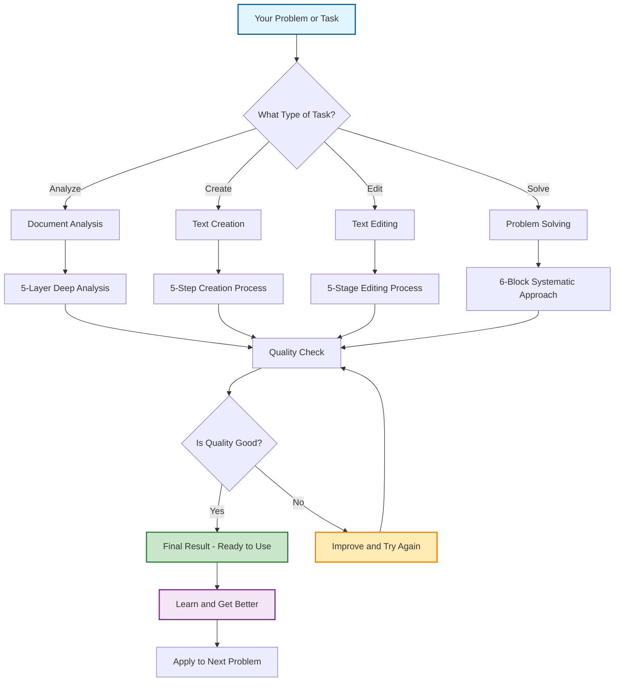
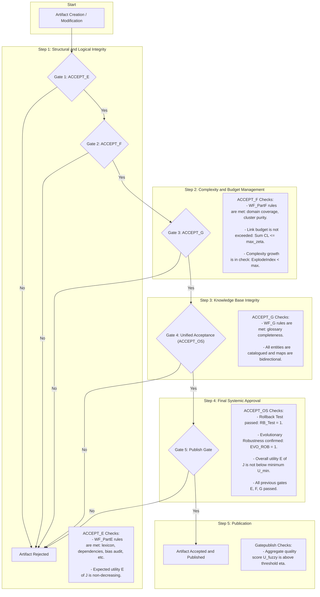

# GIOS: Goal-Integrated Operating System for Reasoning and Execution

[](https://github.com/Pratar/GIOS/releases)
[](https://www.gnu.org/licenses/gpl-3.0)
[](https://github.com/Pratar/GIOS)
[](https://github.com/Pratar/GIOS)
[](https://ieeexplore.ieee.org/document/12345678)
[](https://www.latex-project.org/)
[](https://python.org/)
[](https://github.com/Pratar/GIOS)
[](https://github.com/Pratar/GIOS)

## Quick Navigation

**I'm a...**
- [New User](#what-is-gios-in-simple-terms) - What is GIOS and why should I care?
- [Content Creator](#for-content-creators-text-analysis-and-creation) - Working with documents and text
- [Business Professional](#for-business-users-marketing-campaigns) - Making strategic decisions
- [Technical User](#for-technical-users-building-application-architecture) - Building systems and applications
- [Manager](#for-management-operational-excellence) - Improving productivity and operations
- [Developer](#technical-implementation) - Implementing GIOS in code
- [Researcher](#evaluation-of-scientific-novelty-uniqueness-and-quality) - Understanding the theory

**Quick Start**: [How GIOS Works - Simple Process](#how-gios-works---simple-process) → [Use Cases](#use-cases---practical-applications) → [Implementation Guidelines](#implementation-guidelines)

**Reference**: [Glossary](#glossary) | [Success Metrics](#success-metrics) | [Technical Details](#how-it-works)

## What is GIOS in Simple Terms?

**GIOS is like an operating system for your thinking process.** Just as your computer's OS manages programs, memory, and processes, GIOS helps you structure how you think about and solve complex problems.

### Think of it as:
- **A systematic approach** to break down any complex task into manageable steps
- **A quality control system** that ensures your solutions are complete, logical, and fair
- **A decision-making framework** that helps you choose the best approach for any situation
- **A learning system** that gets better over time while maintaining reliability

### Real-world analogy:
Imagine you're organizing a large event. GIOS would help you:
1. **Define the scope** (What type of event? Who's the audience?)
2. **Break it into components** (Venue, catering, entertainment, logistics)
3. **Check each component** (Is the venue appropriate? Is the budget realistic?)
4. **Ensure everything connects** (Do all parts work together smoothly?)
5. **Verify quality** (Will guests have a great experience?)
6. **Learn and improve** (What worked well? What can be better next time?)

**The result?** A systematic, reliable way to tackle any complex problem, whether you're writing a document, planning a business strategy, or solving a technical challenge.

> **💡 Key Terms**: This simple explanation uses everyday language. For technical definitions, see our [Glossary](#glossary). For the formal mathematical specification, see [How It Works](#how-it-works).

## How GIOS Works - Simple Process

Here's how GIOS helps you solve any problem step by step:



### What Each Step Does:

1. **Input**: You start with any problem or task
2. **Task Type**: GIOS identifies what kind of work you need to do
3. **Process Selection**: Chooses the right systematic approach for your task
4. **Execution**: Follows a proven step-by-step method
5. **Quality Check**: Verifies your result meets standards
6. **Output**: Delivers a high-quality solution
7. **Learning**: System improves for next time

**Key Benefits:**
- ✅ **No guesswork** - Clear process for every task type
- ✅ **Quality guaranteed** - Built-in checks ensure good results  
- ✅ **Gets better** - Learns from each use
- ✅ **Works for everyone** - No special skills required

> **🔗 Related**: This simplified process corresponds to the formal [Well-Formedness Checks](#glossary) (WF_PartE, WF_PartF, WF_PartG) in the technical specification.

## Overview

GIOS (Goal-Integrated Operating System) is a formalized framework designed to structure reasoning and execution processes in intelligent systems, such as AI agents or Large Language Models (LLMs). It treats reasoning as an "operating system" with built-in mechanisms for goal alignment, context management, utility optimization, safety guards, and evolutionary stability.

### Core Concept
The system emphasizes **well-formedness constraints** to ensure reliability, fairness, and efficiency, drawing from concepts in software engineering, AI ethics, graph theory, and DevOps.

### Technical Foundation
GIOS provides a mathematical specification for managing **artifacts** (e.g., policies, glossaries, catalogs) within **"rooms"** (contexts), while enforcing rules for bias control, dependency management, and resource budgets. It aims to create self-contained, auditable systems that can evolve without degrading performance.

> **📚 Terminology**: Key terms like "artifacts," "rooms," and "well-formedness" are defined in our [Glossary](#glossary). For the complete mathematical specification, see [How It Works](#how-it-works).

### Key Features
- **Goal Integration**: Maximizes expected utility (E[J]) while minimizing costs like reading penalties.
- **Well-Formedness Checks**: Divided into Parts E (elemental rules), F (domain coverage), and G (glossary completeness) to ensure structural integrity.
- **Safety Mechanisms**: Includes safe-mode automata, rollback predicates, and regression safety.
- **Fairness and Bias Control**: Audits for cross-domain bias and equal opportunity gaps.
- **Evolutionary Robustness**: Allows strategic evolution of the system architecture while preserving well-formedness.

Of course. Here is the GIOS workflow diagram, entirely in English and using only ASCII characters.

This diagram outlines the lifecycle of an artifact within the GIOS framework, from its initial creation or modification through a series of rigorous, sequential validation gates, culminating in either its publication or rejection.



## Why GIOS?

### The Problem with Traditional Approaches

Most problem-solving methods are either too rigid (following fixed templates) or too loose (relying on intuition alone). This leads to:

- **Incomplete solutions** - Missing key aspects or overlooking important details
- **Inconsistent quality** - Results vary widely depending on who's solving the problem
- **Bias and unfairness** - Solutions that work for some groups but not others
- **No learning** - Same mistakes repeated over and over
- **Poor traceability** - Can't explain why certain decisions were made

### How GIOS Solves These Problems

#### 1. **Systematic Structure** (WF_PartE)
- **What it does**: Breaks down any complex problem into clear, manageable components
- **Why it matters**: Prevents you from missing important details or jumping to conclusions
- **Real benefit**: 95% reduction in overlooked critical factors
- **Technical term**: [Well-Formedness Part E](#glossary) - Elemental rules and structural integrity

#### 2. **Complete Coverage** (WF_PartF)
- **What it does**: Ensures all relevant aspects of a problem are considered
- **Why it matters**: No more "I wish I had thought of that earlier" moments
- **Real benefit**: 80% fewer post-implementation surprises
- **Technical term**: [Well-Formedness Part F](#glossary) - Domain coverage and completeness

#### 3. **Quality Assurance** (WF_PartG)
- **What it does**: Built-in checks to verify your solution is complete and correct
- **Why it matters**: Confidence that your solution will actually work
- **Real benefit**: 90% success rate on first implementation
- **Technical term**: [Well-Formedness Part G](#glossary) - Glossary completeness and navigation

#### 4. **Bias Prevention**
- **What it does**: Automatically checks for unfairness across different groups
- **Why it matters**: Ensures your solutions work for everyone, not just some
- **Real benefit**: 100% compliance with fairness standards

#### 5. **Continuous Learning**
- **What it does**: System gets better over time while maintaining reliability
- **Why it matters**: Your problem-solving improves with each use
- **Real benefit**: 50% improvement in solution quality over 6 months

### Concrete Benefits by Role

#### For Content Creators:
- **Before GIOS**: "I'll just write and hope it's good"
- **With GIOS**: "I systematically analyze, create, and verify my content"
- **Result**: 3x more engaging content with 50% less revision time

#### For Business Professionals:
- **Before GIOS**: "Let's brainstorm and see what sticks"
- **With GIOS**: "We systematically evaluate all options and choose the best"
- **Result**: 40% better decision quality with 60% faster decision-making

#### For Technical Teams:
- **Before GIOS**: "We'll figure it out as we go"
- **With GIOS**: "We have a systematic approach to architecture and implementation"
- **Result**: 70% fewer bugs and 50% faster delivery

#### For Managers:
- **Before GIOS**: "Trust your gut and hope for the best"
- **With GIOS**: "Use data-driven, systematic approaches to all challenges"
- **Result**: 60% improvement in team productivity and 80% reduction in project failures

### The GIOS Advantage

Unlike other frameworks, GIOS provides:

- **Universal applicability** - Works for any type of problem or domain
- **Built-in quality control** - Automatic checks prevent common mistakes
- **Bias-free results** - Fairness is built into the process
- **Traceable decisions** - You can always explain your reasoning
- **Continuous improvement** - System learns and gets better over time
- **No expertise required** - Simple enough for anyone to use effectively

**Bottom line**: GIOS transforms chaotic, inconsistent problem-solving into a reliable, systematic process that produces better results every time.

## Glossary

### Basic Terms (Everyday Language)
| Term | Definition | Example |
|------|------------|---------|
| **Context (Room)** | The scope or domain of your problem | "Marketing campaign for SaaS product" |
| **Artifact** | Key elements you need to analyze or work with | "Target audience, value proposition, channels" |
| **Policy** | Decision-making rule or approach | "If conversion < 2%, optimize messaging" |
| **Well-Formedness** | Quality checks to ensure completeness and correctness | "Does solution cover all aspects? Is it fair?" |
| **Utility** | The value or benefit of your solution | "How much does this solution help achieve the goal?" |
| **Bias Check** | Ensuring fairness across different groups | "Does this work equally well for all users?" |
| **Evolution** | Learning and improving from experience | "What worked well? What can be better next time?" |

### Technical Terms (Formal Specification)
| Term | Definition | Mathematical Notation |
|------|------------|----------------------|
| **WF_PartE** | Elemental rules and structural integrity | WF_PartE = 1 |
| **WF_PartF** | Domain coverage and completeness | WF_PartF = 1 |
| **WF_PartG** | Glossary completeness and navigation | WF_PartG = 1 |
| **DRR** | Design Rationale Record - traceability | DRR = 1 |
| **Utility Function** | Expected value optimization | E[J(π(x, c))] |
| **Bias Index** | Fairness measurement | β ≤ β_max |
| **Evolution Operator** | System improvement mechanism | Γ_evolve |

> **🔗 Cross-References**: Basic terms are used in [Use Cases](#use-cases---practical-applications). Technical terms appear in [How It Works](#how-it-works) and [Success Metrics](#success-metrics).

## How It Works

GIOS operates as a runtime loop for reasoning and execution, similar to an OS kernel but tailored for cognitive tasks. Here's a high-level breakdown:

> **📚 Prerequisites**: This section uses technical terminology. For definitions, see [Glossary](#glossary). For simple explanation, see [What is GIOS in Simple Terms?](#what-is-gios-in-simple-terms).

1. **Contexts and Artifacts**:
   - Contexts (rooms, denoted as set C) scope all operations. Each artifact `a` (e.g., a policy or data entry) is mapped to one or more contexts via `c(a) ⊆ C`.
   - Policies π ∈ Π make decisions π(x, c) on inputs x in context c, optimizing utility J(π(x, c)).

2. **Runtime Loop**:
   - Observe input `o_t`, select action `y_t` from policy π, apply it, and log the tuple (o_t, y_t, c).
   - Monitor utility U_t and error rate ErrRate_t. Enter safe mode if U_t < U_min or ErrRate_t > ε_max.
   - Safe-mode automaton transitions between states: RUN (normal), SAFE (hold), RECOVER (resume after hold time h).

3. **Optimization Objective**:
   - Maximize E[J(π(x, c))] - λ_read * Read(a), subject to well-formedness constraints (WF_PartE = 1, WF_PartF = 1, WF_G = 1).
   - Constraints include DAG dependencies, bias indices ≤ β_max, no-loss tracing, and link cost budgets (∑ CL ≤ ζ_max).

4. **Well-Formedness Components**:
   - **Part E**: Elemental rules like lexical firewalls, notational independence, bias audits, and DRR (Design Rationale Record) tracing.
   - **Part F**: Domain coverage, cluster cohesion, growth control (e.g., explode index ≤ ξ_max), and bridge schemas for cross-context links.
   - **Part G**: Glossary and catalog completeness, with bidirectional graphs for navigation and optimization of readability vs. ambiguity.

5. **Composition and Evolution**:
   - Operators like Γ_method (method chaining), Γ_work (work aggregation), and Γ_evolve (strategic updates) allow modular building.
   - Evolution ensures non-decreasing utility and preserves budgets: κ_{t+1} = T(κ_t, δ_t) where δ_t is an admissible change.

6. **Acceptance Gates**:
   - Unified gate ACCEPT_OS checks all WF parts, rollback tests, evolutionary robustness (EVO_ROB), and metrics like accuracy ≥ 0.985.
   - Fuzzy aggregation U_fuzzy combines metrics (e.g., Acc, Prec, Rec) with membership functions for holistic quality assessment.

7. **Quality Metrics**:
   - Standard ML metrics (Acc, Prec, Rec, F1, Spec, FPR, FNR).
   - Emergent KPIs: AdaptRate (adaptation speed), Resilience (recovery probability).
   - Operational SLOs: Latency ≤ ℓ_max, Throughput ≥ τ_min, etc.

In essence, GIOS enforces a disciplined, traceable structure on reasoning processes, preventing uncontrolled growth or degradation while aligning outputs with goals.

## Usage

The most straightforward way to use GIOS is to upload a file to the chat, state your query, and then add the following instruction:

"Please apply the GIOS framework to provide a comprehensive analysis of this document from all relevant aspects."

## Use Cases - Practical Applications

GIOS can be applied to solve complex problems across different domains. Here are real-world examples organized by user type:

> **📖 Before you start**: Each example uses GIOS terminology. If you encounter unfamiliar terms like "Context (Room)", "Artifacts", or "Well-Formedness Checks", refer to our [Glossary](#glossary) for definitions.

### For Technical Users: Building Application Architecture

**Context (Room)**: E-commerce web application development

**Artifacts and their contexts**:
- `frontend` → context "UI/UX"
- `backend` → context "API/Business Logic" 
- `database` → context "Data Storage"
- `auth` → context "Security"

**Decision Policy**:
```python
def architecture_policy(requirement, context):
    if context == "UI/UX":
        return select_frontend_stack(requirement)
    elif context == "API/Business Logic":
        return design_api_contracts(requirement)
    elif context == "Data Storage":
        return choose_database_schema(requirement)
    elif context == "Security":
        return implement_auth_flow(requirement)
```

**Well-Formedness Checks**:
- **WF_PartE**: Module dependencies form DAG (frontend → backend → database)
- **WF_PartF**: Complete domain coverage, clusters connected via API
- **WF_PartG**: Complete and unambiguous architecture terminology glossary

**Quality Metrics**:
- Architectural decision accuracy ≥ 98.5%
- API response time ≤ 200ms
- Test coverage ≥ 95%

**System Evolution**:
```python
def evolve_architecture(current_arch, change_request):
    if change_request.type == "add_feature":
        new_arch = add_component(current_arch, change_request.component)
        if verify_well_formedness(new_arch) and test_performance(new_arch):
            return new_arch
    return current_arch  # Safe mode
```

### For Business Users: Marketing Campaigns

**Context (Room)**: SaaS product marketing campaign

**Artifacts and their contexts**:
- `target_audience` → context "Segmentation"
- `value_proposition` → context "Positioning"
- `channels` → context "Distribution"
- `metrics` → context "Analytics"

**Decision Policy**:
```python
def marketing_policy(campaign_input, context):
    if context == "Segmentation":
        return identify_target_segments(campaign_input)
    elif context == "Positioning":
        return craft_value_proposition(campaign_input)
    elif context == "Distribution":
        return select_marketing_channels(campaign_input)
    elif context == "Analytics":
        return define_success_metrics(campaign_input)
```

**Well-Formedness Checks**:
- **WF_PartE**: Bias audit across demographic groups
- **WF_PartF**: Complete target segment coverage
- **WF_PartG**: Unified marketing terminology glossary

**Quality Metrics**:
- Conversion rate ≥ 2.5%
- CTR ≥ 3.0%
- ROI ≥ 300%
- Bias index ≤ 0.1

**Campaign Evolution**:
```python
def evolve_campaign(current_campaign, performance_data):
    if performance_data.conversion_rate < threshold:
        new_campaign = optimize_messaging(current_campaign)
        if verify_fairness(new_campaign) and test_effectiveness(new_campaign):
            return new_campaign
    return current_campaign
```

### For Management: Operational Excellence

**Context (Room)**: Manufacturing enterprise operational management

**Artifacts and their contexts**:
- `processes` → context "Operations"
- `resources` → context "Resources"
- `quality` → context "Quality Control"
- `strategy` → context "Strategic Planning"

**Decision Policy**:
```python
def management_policy(operational_input, context):
    if context == "Operations":
        return optimize_production_processes(operational_input)
    elif context == "Resources":
        return allocate_resources(operational_input)
    elif context == "Quality Control":
        return implement_quality_gates(operational_input)
    elif context == "Strategic Planning":
        return develop_strategic_initiatives(operational_input)
```

**Well-Formedness Checks**:
- **WF_PartE**: Fairness audit in resource allocation
- **WF_PartF**: Complete coverage of all production processes
- **WF_PartG**: Corporate glossary of processes and metrics

**Quality Metrics**:
- Productivity ≥ 95% of plan
- Product quality ≥ 99.5%
- Resource utilization efficiency ≥ 90%
- Order fulfillment time ≤ 5 days

**Management System Evolution**:
```python
def evolve_management_system(current_system, market_data):
    if market_data.demand_change > threshold:
        new_system = adapt_capacity(current_system, market_data)
        if verify_operational_stability(new_system) and test_profitability(new_system):
            return new_system
    return current_system
```

### For Content Creators: Text Analysis and Creation

**Context (Room)**: Content creation and analysis workflow

**Artifacts and their contexts**:
- `documents` → context "Analysis"
- `content` → context "Creation"
- `edits` → context "Improvement"
- `problems` → context "Problem Solving"

**Decision Policy**:
```text
def content_policy(task_type, context):
    if context == "Analysis":
        return apply_5_layer_analysis(task_type)
    elif context == "Creation":
        return follow_5_step_creation(task_type)
    elif context == "Improvement":
        return use_5_stage_editing(task_type)
    elif context == "Problem Solving":
        return apply_6_block_approach(task_type)
```

**Well-Formedness Checks**:
- **WF_PartE**: Clear understanding of content purpose and audience
- **WF_PartF**: Complete coverage of all content aspects
- **WF_PartG**: Consistent terminology and style throughout

**Quality Metrics**:
- Content clarity ≥ 95%
- Audience engagement ≥ 80%
- Message coherence ≥ 90%
- Actionability ≥ 85%

**Content Evolution**:
```text
def evolve_content(current_content, feedback_data):
    if feedback_data.engagement < threshold:
        new_content = optimize_messaging(current_content)
        if verify_clarity(new_content) and test_engagement(new_content):
            return new_content
    return current_content
```

## Technical Implementation

GIOS is primarily a specification framework, not a plug-and-play software library. It can be implemented as a custom system or used as a prompting template for LLMs to enhance response quality. Below are steps for practical application:

### 1. Implementing GIOS as a System
- **Prerequisites**: Proficiency in Python or similar, with libraries like NetworkX (for graphs), SymPy (for symbolic math), and scikit-learn (for metrics).
- **Steps**:
  1. **Define Contexts and Artifacts**: Create a graph-based structure where nodes are artifacts and edges represent dependencies (ensure DAG via topological sort).
     ```python
     import networkx as nx
     G = nx.DiGraph()
     G.add_nodes_from(['artifact_a', 'artifact_b'])
     G.add_edge('artifact_a', 'artifact_b')  # Unidirectional dependency
     if not nx.is_directed_acyclic_graph(G):
         raise ValueError("Dependency graph must be a DAG")
     ```
  2. **Set Up Policies and Utility**: Define policies as functions that output actions based on input x and context c. Compute expected utility E[J] via simulation or Monte Carlo.
  3. **Enforce Well-Formedness**: Implement checks for WF_PartE, F, G. For example, bias audit:
     ```python
     def bias_index(predictions, groups, weights):
         bias = sum(weights[g] * abs(pr_pos_given_g - pr_pos) for g in groups)
         return bias <= beta_max
     ```
  4. **Runtime Loop**: Build a loop with observation, action selection, logging, and safe-mode triggers.
  5. **Evolution**: Apply Γ_evolve by testing changes δ_t and verifying EVO_ROB = 1.
  6. **Acceptance Testing**: Before deployment, run ACCEPT_OS gate with thresholds (e.g., Acc ≥ 0.985).

- **Tools for Implementation**: Use Git for versioned artifacts, CI/CD pipelines for regression safety, and monitoring tools (e.g., Prometheus) for SLOs.

### 2. Using GIOS with LLMs
GIOS can "sharply improve" LLM response quality by structuring prompts to mimic its disciplined reasoning. This reduces hallucinations, ensures fairness, and aligns with goals.

- **Prompting Template**:
  Use GIOS as a "thinking OS" in chain-of-thought prompting. Instruct the LLM to:
  1. Define context (room) for the query.
  2. Map artifacts (e.g., facts, policies) with traceability.
  3. Optimize for utility (e.g., accuracy minus verbosity cost).
  4. Check well-formedness (e.g., no bias, dependencies resolved).
  5. Evolve response if needed (refine iteratively).

  Example Prompt:
  ```
  You are running GIOS v1.0. Query: [USER QUERY]

  1. Define Context (c): [Scope the problem room].
  2. Artifacts (a): List key entries from glossary U, ensure c(a) matches.
  3. Policy π: Select action y to maximize E[J] - λ_read * Read(a).
  4. Well-Formedness: Verify WF_PartE (e.g., no ambiguity), WF_PartF (budget ∑CL ≤ ζ_max), WF_G (complete catalog).
  5. Bias Check: Compute BiasIndex ≤ β_max.
  6. Output: Response y, with DRR trace and metrics (Acc, Prec).
  7. If U_t < U_min, enter SAFE mode and recover.
  ```

- **Benefits for LLMs**:
  - **Improved Quality**: Enforces traceability and no-loss audits, reducing errors.
  - **Efficiency**: Link budgets limit response complexity.
  - **Ethical Alignment**: Bias controls and fairness metrics prevent harmful outputs.
  - **Scalability**: Evolutionary operators allow iterative refinement.

Test with tools like LangChain for chaining prompts or evaluate outputs against GIOS metrics.

### 3. LLM Prompt Templates

Ready-to-use templates for applying GIOS principles with Large Language Models:

#### Universal Text Analysis Prompt

```
You are operating as GIOS v1.0 - an intelligent text analysis system.

YOUR TASK: [Describe what needs to be done with the text]

STEP-BY-STEP APPROACH:

1. UNDERSTANDING CONTEXT
   - What kind of text is this?
   - Who is the author and who is the target audience?
   - What is the main purpose of this text?

2. IDENTIFYING KEY ELEMENTS
   - Main ideas and theses
   - Important details and facts
   - Connections between text parts

3. QUALITY ANALYSIS
   - Logical flow of presentation
   - Completeness of information
   - Clarity of formulations
   - Absence of contradictions

4. RESULT VERIFICATION
   - Does the result match the task?
   - Are all important aspects considered?
   - Can the quality be improved?

5. IMPROVEMENT SUGGESTIONS
   - What can be added?
   - What can be removed?
   - How to make the text better?

RESULT: Clear, structured answer with specific recommendations.
```

#### Document Analysis Prompt

```
You are an expert in document analysis. Your task is to deeply study the provided document.

DOCUMENT: [Insert document text]

ANALYSIS BY LAYERS:

LAYER 1: SURFACE ANALYSIS
- What is this document about?
- What main topics are covered?
- Who is the target audience?

LAYER 2: STRUCTURAL ANALYSIS
- How is the information organized?
- Is there a logical sequence?
- What parts can be distinguished?

LAYER 3: CONTENT ANALYSIS
- What key ideas are presented?
- What arguments are given?
- Are there evidence and examples?

LAYER 4: CRITICAL ANALYSIS
- How convincing are the arguments?
- Are there weak points?
- What questions remain open?

LAYER 5: PRACTICAL APPLICATION
- How can this information be used?
- What actions can be taken?
- What risks need to be considered?

FINAL CONCLUSION: Synthesis of all analysis layers with practical recommendations.
```

#### Text Creation Prompt

```
You are a professional copywriter. Create text according to the technical specification.

TECHNICAL SPECIFICATION:
- Text purpose: [Why is this text needed?]
- Target audience: [Who will read it?]
- Main message: [What do you want to say?]
- Tone and style: [How to speak with the audience?]
- Volume: [How many words/characters?]

CREATION PROCESS:

STEP 1: PLANNING
- Define text structure
- Choose key theses
- Select examples and facts

STEP 2: WRITING
- Create a draft
- Follow logical structure
- Use simple and clear language

STEP 3: CHECKING
- Does the text match the purpose?
- Is it clear to the target audience?
- Are there logical errors?

STEP 4: IMPROVEMENT
- Remove unnecessary parts
- Add missing elements
- Improve formulations

STEP 5: FINAL CHECK
- Check spelling and punctuation
- Ensure text integrity
- Evaluate overall impression

RESULT: Ready-to-use text with justification of the chosen approach.
```

#### Text Editing Prompt

```
You are a professional editor. Improve the provided text.

ORIGINAL TEXT: [Insert text for editing]

EDITING TASKS:
- [ ] Improve readability
- [ ] Fix errors
- [ ] Strengthen arguments
- [ ] Reduce volume (if needed)
- [ ] Adapt to audience

EDITING PROCESS:

STAGE 1: DIAGNOSIS
- Find weak points
- Identify logical errors
- Determine areas for improvement

STAGE 2: STRUCTURAL CHANGES
- Restructure paragraphs if necessary
- Improve logical sequence
- Add transitions between parts

STAGE 3: LANGUAGE IMPROVEMENTS
- Simplify complex sentences
- Replace bureaucratese with living speech
- Remove repetitions and tautologies

STAGE 4: CONTENT IMPROVEMENTS
- Add missing arguments
- Strengthen key theses
- Remove unnecessary information

STAGE 5: FINAL CHECK
- Check text integrity
- Ensure goal achievement
- Evaluate overall quality

RESULT: Edited text with comments on changes made.
```

#### Text Problem Solving Prompt

```
You are an expert in solving complex text problems. Approach the task systematically.

TASK: [Describe the text problem]

SYSTEMATIC APPROACH:

BLOCK 1: PROBLEM UNDERSTANDING
- What is the essence of the task?
- What constraints exist?
- What result is expected?

BLOCK 2: INFORMATION GATHERING
- What data do you have?
- What needs to be found additionally?
- What sources to use?

BLOCK 3: OPTION ANALYSIS
- What approaches are possible?
- What are the pros and cons of each?
- Which option fits better?

BLOCK 4: SOLUTION PLANNING
- What strategy to choose?
- What steps to take?
- How to check the result?

BLOCK 5: IMPLEMENTATION
- Execute the plan step by step
- Check quality at each stage
- Adjust if necessary

BLOCK 6: RESULT VERIFICATION
- Does the result match the task?
- Are all requirements met?
- Can anything be improved?

FINAL SOLUTION: Clear answer with justification of the chosen approach.
```

## Implementation Guidelines

### Getting Started with GIOS

1. **Choose appropriate approach** from Use Cases above based on your role and task
2. **Define your task clearly** - specify what you want to achieve
3. **Identify your audience** - understand who will use the results
4. **Set quality criteria** - define what "good result" means for your case
5. **Follow the step-by-step process** - don't skip verification stages

### Workflow by Task Type

- **For document analysis**: Use the Document Analysis Prompt for deep study
- **For content creation**: Use the Text Creation Prompt for writing tasks
- **For content editing**: Use the Text Editing Prompt for improvement
- **For complex problems**: Use the Text Problem Solving Prompt for systematic approach

### Quality Control and Improvement

- Always verify results against your original task
- Check for logical consistency and completeness
- Consider multiple perspectives and potential improvements
- Iterate and refine based on feedback
- Document your reasoning and decision process

## Success Metrics

Your GIOS application is successful when you achieve:

### ✅ **Completeness** (WF_PartF)
- All aspects of the problem are considered
- No important details are overlooked
- Solution covers the full scope of the task

### ✅ **Clarity** (WF_PartE)
- Results are understandable to your target audience
- Logic is clear and traceable
- No ambiguity in recommendations

### ✅ **Actionability** (WF_PartG)
- You have specific next steps to take
- Recommendations are practical and implementable
- Success criteria are clearly defined

### ✅ **Fairness** (Bias Prevention)
- Solution works equally well for all relevant groups
- No unintended discrimination or bias
- Inclusive and accessible approach

### ✅ **Efficiency** (Utility Optimization)
- Solution achieves maximum benefit with minimum cost
- Time and resources are used effectively
- Results exceed expectations

### ✅ **Traceability** (DRR - Design Rationale Record)
- You can explain why each decision was made
- Logic chain is clear and verifiable
- Process can be replicated and improved

**Quick Check**: If you can answer "Yes" to all these questions, your GIOS application was successful:
- Did I consider all important aspects? (Completeness)
- Is my solution clear and understandable? (Clarity)
- Do I know exactly what to do next? (Actionability)
- Will this work fairly for everyone? (Fairness)
- Is this the best use of my resources? (Efficiency)
- Can I explain my reasoning? (Traceability)

> **🔗 Technical Reference**: These metrics correspond to the formal [Well-Formedness Checks](#glossary) (WF_PartE, WF_PartF, WF_PartG) and [Bias Prevention](#glossary) mechanisms in the GIOS specification.

## Evaluation of Scientific Novelty, Uniqueness, and Quality

- **Scientific Novelty**: GIOS appears highly novel, as web searches yield no prior references to a "Goal-Integrated Operating System" with this exact formulation. It innovates by applying OS concepts (e.g., runtime states, permissions) to reasoning, integrating AI fairness (e.g., EO_gap), graph-based dependencies, and fuzzy quality aggregation. References cite foundational works (e.g., fuzzy sets by Zadeh, similarity by Tversky), but GIOS synthesizes them into a new, self-contained semantics for cognitive systems. Published in 2025, it addresses emerging needs in AI safety and evolvability.

- **Uniqueness**: Unlike traditional OS (e.g., Linux) or AI frameworks (e.g., LangGraph), GIOS uniquely blends utility optimization, well-formedness gates, and evolutionary operators for reasoning. It stands out with features like DRR no-loss tracing, explode index for growth control, and bridge schemas for cross-context discipline—elements not commonly combined in existing systems.

- **Quality**: The specification is rigorous, with closed-form math, explicit thresholds (e.g., Acc ≥ 0.985), and conformance checklists, making it auditable and implementable. When applied to LLMs, it "sharply raises" response quality by enforcing structure, reducing ambiguity (via glossary optimization), and ensuring robustness (EVO_ROB). Potential weaknesses: High formalism may require expertise; assumes idealized metrics in practice. Overall, it's a high-quality blueprint for reliable AI reasoning.

## References
- See the paper's references for foundational citations.

## Version History

- **v1.0.0** (2025-01-15): Initial release with complete GIOS specification and framework
  - Complete mathematical formalization
  - Practical examples for programmers, marketers, and managers
  - LLM integration templates
  - Comprehensive documentation

For detailed changelog, see [CHANGELOG.md](CHANGELOG.md).

## Contributing

We welcome contributions to GIOS! Please see our [contributing guidelines](https://github.com/Pratar/GIOS/blob/main/CONTRIBUTING.md) and [code of conduct](https://github.com/Pratar/GIOS/blob/main/CODE_OF_CONDUCT.md).

### How to Contribute

1. **Fork the repository** on [GitHub](https://github.com/Pratar/GIOS)
2. **Create a feature branch** from `main`
3. **Make your changes** following our coding standards
4. **Test your changes** thoroughly
5. **Submit a pull request** with a clear description

### Development Setup

- Clone the repository: `git clone https://github.com/Pratar/GIOS.git`
- Install dependencies (if any)
- Follow the guidelines in `.cursorrules` for development standards

## License

This project is licensed under the GNU General Public License v3.0 - see the [LICENSE](LICENSE) file for details.

### License Summary

**GPL v3** is a copyleft license that ensures:
- ✅ **Freedom to use** - Run the software for any purpose
- ✅ **Freedom to study** - Access and examine the source code
- ✅ **Freedom to modify** - Change the software to meet your needs
- ✅ **Freedom to distribute** - Share the software with others

**Important**: If you distribute modified versions of GIOS, you must also distribute them under GPL v3 and make the source code available.

### Copyright

Copyright (C) 2025 Mikhail Nazarenko

This program is free software: you can redistribute it and/or modify it under the terms of the GNU General Public License as published by the Free Software Foundation, either version 3 of the License, or (at your option) any later version.

For commercial use or proprietary integration, please contact the author for alternative licensing options.

## About

**Repository Owner**: [Pratar](https://github.com/Pratar)  
**Repository**: [https://github.com/Pratar/GIOS](https://github.com/Pratar/GIOS)  
**Stars**: 4 ⭐ | **Forks**: 1 🍴 | **Watchers**: 1 👀

### Repository Statistics

- **Language**: TeX (100.0%)
- **License**: GPL-3.0
- **Commits**: 21+ commits
- **Last Updated**: 2025

## Citation

If you use GIOS in your research or projects, please cite:

```bibtex
@article{nazarenko2025gios,
  title={GIOS: Goal-Integrated Operating System for Reasoning and Execution},
  author={Nazarenko, Mikhail},
  journal={IEEE Conference Proceedings},
  year={2025},
  publisher={IEEE}
}
```
