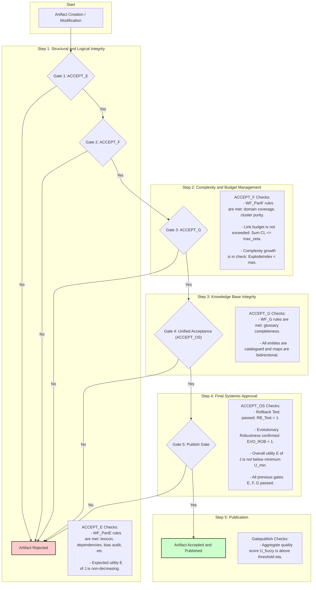

# GIOS: Goal-Integrated Operating System for Reasoning and Execution

[](https://github.com/your-username/GIOS/releases)
[](LICENSE)
[](https://github.com/your-username/GIOS)

## Overview

GIOS (Goal-Integrated Operating System) is a formalized framework designed to structure reasoning and execution processes in intelligent systems, such as AI agents or Large Language Models (LLMs). It treats reasoning as an "operating system" with built-in mechanisms for goal alignment, context management, utility optimization, safety guards, and evolutionary stability. The system emphasizes well-formedness constraints to ensure reliability, fairness, and efficiency, drawing from concepts in software engineering, AI ethics, graph theory, and DevOps.

Developed GIOS provides a mathematical specification for managing artifacts (e.g., policies, glossaries, catalogs) within "rooms" (contexts), while enforcing rules for bias control, dependency management, and resource budgets (e.g., reading costs, link budgets). It aims to create self-contained, auditable systems that can evolve without degrading performance.

### Key Features
- **Goal Integration**: Maximizes expected utility (E[J]) while minimizing costs like reading penalties.
- **Well-Formedness Checks**: Divided into Parts E (elemental rules), F (domain coverage), and G (glossary completeness) to ensure structural integrity.
- **Safety Mechanisms**: Includes safe-mode automata, rollback predicates, and regression safety.
- **Fairness and Bias Control**: Audits for cross-domain bias and equal opportunity gaps.
- **Evolutionary Robustness**: Allows strategic evolution of the system architecture while preserving well-formedness.

Of course. Here is the GIOS workflow diagram, entirely in English and using only ASCII characters.

This diagram outlines the lifecycle of an artifact within the GIOS framework, from its initial creation or modification through a series of rigorous, sequential validation gates, culminating in either its publication or rejection.



## How It Works

GIOS operates as a runtime loop for reasoning and execution, similar to an OS kernel but tailored for cognitive tasks. Here's a high-level breakdown:

1. **Contexts and Artifacts**:
   - Contexts (rooms, denoted as set C) scope all operations. Each artifact `a` (e.g., a policy or data entry) is mapped to one or more contexts via `c(a) ⊆ C`.
   - Policies π ∈ Π make decisions π(x, c) on inputs x in context c, optimizing utility J(π(x, c)).

2. **Runtime Loop**:
   - Observe input `o_t`, select action `y_t` from policy π, apply it, and log the tuple (o_t, y_t, c).
   - Monitor utility U_t and error rate ErrRate_t. Enter safe mode if U_t < U_min or ErrRate_t > ε_max.
   - Safe-mode automaton transitions between states: RUN (normal), SAFE (hold), RECOVER (resume after hold time h).

3. **Optimization Objective**:
   - Maximize E[J(π(x, c))] - λ_read * Read(a), subject to well-formedness constraints (WF_PartE = 1, WF_PartF = 1, WF_G = 1).
   - Constraints include DAG dependencies, bias indices ≤ β_max, no-loss tracing, and link cost budgets (∑ CL ≤ ζ_max).

4. **Well-Formedness Components**:
   - **Part E**: Elemental rules like lexical firewalls, notational independence, bias audits, and DRR (Design Rationale Record) tracing.
   - **Part F**: Domain coverage, cluster cohesion, growth control (e.g., explode index ≤ ξ_max), and bridge schemas for cross-context links.
   - **Part G**: Glossary and catalog completeness, with bidirectional graphs for navigation and optimization of readability vs. ambiguity.

5. **Composition and Evolution**:
   - Operators like Γ_method (method chaining), Γ_work (work aggregation), and Γ_evolve (strategic updates) allow modular building.
   - Evolution ensures non-decreasing utility and preserves budgets: κ_{t+1} = T(κ_t, δ_t) where δ_t is an admissible change.

6. **Acceptance Gates**:
   - Unified gate ACCEPT_OS checks all WF parts, rollback tests, evolutionary robustness (EVO_ROB), and metrics like accuracy ≥ 0.985.
   - Fuzzy aggregation U_fuzzy combines metrics (e.g., Acc, Prec, Rec) with membership functions for holistic quality assessment.

7. **Quality Metrics**:
   - Standard ML metrics (Acc, Prec, Rec, F1, Spec, FPR, FNR).
   - Emergent KPIs: AdaptRate (adaptation speed), Resilience (recovery probability).
   - Operational SLOs: Latency ≤ ℓ_max, Throughput ≥ τ_min, etc.

In essence, GIOS enforces a disciplined, traceable structure on reasoning processes, preventing uncontrolled growth or degradation while aligning outputs with goals.

## Usage

The most straightforward way to use GIOS is to upload a file to the chat, state your query, and then add the following instruction:

"Please apply the GIOS framework to provide a comprehensive analysis of this document from all relevant aspects."

## Practical GIOS Application Examples

### For Programmers: Building Application Architecture

**Context (Room)**: E-commerce web application development

**Artifacts and their contexts**:
- `frontend` → context "UI/UX"
- `backend` → context "API/Business Logic" 
- `database` → context "Data Storage"
- `auth` → context "Security"

**Decision Policy**:
```python
def architecture_policy(requirement, context):
    if context == "UI/UX":
        return select_frontend_stack(requirement)
    elif context == "API/Business Logic":
        return design_api_contracts(requirement)
    elif context == "Data Storage":
        return choose_database_schema(requirement)
    elif context == "Security":
        return implement_auth_flow(requirement)
```

**Well-Formedness Checks**:
- **WF_PartE**: Module dependencies form DAG (frontend → backend → database)
- **WF_PartF**: Complete domain coverage, clusters connected via API
- **WF_PartG**: Complete and unambiguous architecture terminology glossary

**Quality Metrics**:
- Architectural decision accuracy ≥ 98.5%
- API response time ≤ 200ms
- Test coverage ≥ 95%

**System Evolution**:
```python
def evolve_architecture(current_arch, change_request):
    if change_request.type == "add_feature":
        new_arch = add_component(current_arch, change_request.component)
        if verify_well_formedness(new_arch) and test_performance(new_arch):
            return new_arch
    return current_arch  # Safe mode
```

### For Marketers: Product Promotion

**Context (Room)**: SaaS product marketing campaign

**Artifacts and their contexts**:
- `target_audience` → context "Segmentation"
- `value_proposition` → context "Positioning"
- `channels` → context "Distribution"
- `metrics` → context "Analytics"

**Decision Policy**:
```python
def marketing_policy(campaign_input, context):
    if context == "Segmentation":
        return identify_target_segments(campaign_input)
    elif context == "Positioning":
        return craft_value_proposition(campaign_input)
    elif context == "Distribution":
        return select_marketing_channels(campaign_input)
    elif context == "Analytics":
        return define_success_metrics(campaign_input)
```

**Well-Formedness Checks**:
- **WF_PartE**: Bias audit across demographic groups
- **WF_PartF**: Complete target segment coverage
- **WF_PartG**: Unified marketing terminology glossary

**Quality Metrics**:
- Conversion rate ≥ 2.5%
- CTR ≥ 3.0%
- ROI ≥ 300%
- Bias index ≤ 0.1

**Campaign Evolution**:
```python
def evolve_campaign(current_campaign, performance_data):
    if performance_data.conversion_rate < threshold:
        new_campaign = optimize_messaging(current_campaign)
        if verify_fairness(new_campaign) and test_effectiveness(new_campaign):
            return new_campaign
    return current_campaign
```

### For Enterprise Directors: Improving Productivity and Revenue

**Context (Room)**: Manufacturing enterprise operational management

**Artifacts and their contexts**:
- `processes` → context "Operations"
- `resources` → context "Resources"
- `quality` → context "Quality Control"
- `strategy` → context "Strategic Planning"

**Decision Policy**:
```python
def management_policy(operational_input, context):
    if context == "Operations":
        return optimize_production_processes(operational_input)
    elif context == "Resources":
        return allocate_resources(operational_input)
    elif context == "Quality Control":
        return implement_quality_gates(operational_input)
    elif context == "Strategic Planning":
        return develop_strategic_initiatives(operational_input)
```

**Well-Formedness Checks**:
- **WF_PartE**: Fairness audit in resource allocation
- **WF_PartF**: Complete coverage of all production processes
- **WF_PartG**: Corporate glossary of processes and metrics

**Quality Metrics**:
- Productivity ≥ 95% of plan
- Product quality ≥ 99.5%
- Resource utilization efficiency ≥ 90%
- Order fulfillment time ≤ 5 days

**Management System Evolution**:
```python
def evolve_management_system(current_system, market_data):
    if market_data.demand_change > threshold:
        new_system = adapt_capacity(current_system, market_data)
        if verify_operational_stability(new_system) and test_profitability(new_system):
            return new_system
    return current_system
```

## Technical Implementation

GIOS is primarily a specification framework, not a plug-and-play software library. It can be implemented as a custom system or used as a prompting template for LLMs to enhance response quality. Below are steps for practical application:

### 1. Implementing GIOS as a System
- **Prerequisites**: Proficiency in Python or similar, with libraries like NetworkX (for graphs), SymPy (for symbolic math), and scikit-learn (for metrics).
- **Steps**:
  1. **Define Contexts and Artifacts**: Create a graph-based structure where nodes are artifacts and edges represent dependencies (ensure DAG via topological sort).
     ```python
     import networkx as nx
     G = nx.DiGraph()
     G.add_nodes_from(['artifact_a', 'artifact_b'])
     G.add_edge('artifact_a', 'artifact_b')  # Unidirectional dependency
     if not nx.is_directed_acyclic_graph(G):
         raise ValueError("Dependency graph must be a DAG")
     ```
  2. **Set Up Policies and Utility**: Define policies as functions that output actions based on input x and context c. Compute expected utility E[J] via simulation or Monte Carlo.
  3. **Enforce Well-Formedness**: Implement checks for WF_PartE, F, G. For example, bias audit:
     ```python
     def bias_index(predictions, groups, weights):
         bias = sum(weights[g] * abs(pr_pos_given_g - pr_pos) for g in groups)
         return bias <= beta_max
     ```
  4. **Runtime Loop**: Build a loop with observation, action selection, logging, and safe-mode triggers.
  5. **Evolution**: Apply Γ_evolve by testing changes δ_t and verifying EVO_ROB = 1.
  6. **Acceptance Testing**: Before deployment, run ACCEPT_OS gate with thresholds (e.g., Acc ≥ 0.985).

- **Tools for Implementation**: Use Git for versioned artifacts, CI/CD pipelines for regression safety, and monitoring tools (e.g., Prometheus) for SLOs.

### 2. Using GIOS with LLMs
GIOS can "sharply improve" LLM response quality by structuring prompts to mimic its disciplined reasoning. This reduces hallucinations, ensures fairness, and aligns with goals.

- **Prompting Template**:
  Use GIOS as a "thinking OS" in chain-of-thought prompting. Instruct the LLM to:
  1. Define context (room) for the query.
  2. Map artifacts (e.g., facts, policies) with traceability.
  3. Optimize for utility (e.g., accuracy minus verbosity cost).
  4. Check well-formedness (e.g., no bias, dependencies resolved).
  5. Evolve response if needed (refine iteratively).

  Example Prompt:
  ```
  You are running GIOS v1.0. Query: [USER QUERY]

  1. Define Context (c): [Scope the problem room].
  2. Artifacts (a): List key entries from glossary U, ensure c(a) matches.
  3. Policy π: Select action y to maximize E[J] - λ_read * Read(a).
  4. Well-Formedness: Verify WF_PartE (e.g., no ambiguity), WF_PartF (budget ∑CL ≤ ζ_max), WF_G (complete catalog).
  5. Bias Check: Compute BiasIndex ≤ β_max.
  6. Output: Response y, with DRR trace and metrics (Acc, Prec).
  7. If U_t < U_min, enter SAFE mode and recover.
  ```

- **Benefits for LLMs**:
  - **Improved Quality**: Enforces traceability and no-loss audits, reducing errors.
  - **Efficiency**: Link budgets limit response complexity.
  - **Ethical Alignment**: Bias controls and fairness metrics prevent harmful outputs.
  - **Scalability**: Evolutionary operators allow iterative refinement.

Test with tools like LangChain for chaining prompts or evaluate outputs against GIOS metrics.

## LLM Prompt Templates

### Universal GIOS Template

```
You are operating as GIOS v1.0 - a goal-integrated decision-making system.

QUERY: [Your question]

GIOS ALGORITHM:

1. CONTEXT DEFINITION (Room C):
   - Define the scope of application for the solution
   - Specify boundaries and constraints of the context

2. ARTIFACT MAPPING (a ∈ A):
   - Identify key elements for analysis
   - Establish connections between artifacts: c(a) ⊆ C

3. DECISION POLICY (π):
   - Define selection criteria: π(x,c) → y
   - Maximize utility: E[J(π(x,c))] - λ_read * Read(a)

4. WELL-FORMEDNESS CHECKS:
   - WF_PartE: Dependency checks, bias audit
   - WF_PartF: Domain coverage, complexity control
   - WF_PartG: Glossary completeness, navigation

5. QUALITY METRICS:
   - Accuracy ≥ 98.5%
   - Performance within SLO limits
   - Bias index ≤ β_max

6. SOLUTION EVOLUTION:
   - If U_t < U_min → SAFE mode
   - Apply Γ_evolve for improvement
   - Verify EVO_ROB = 1

OUTPUT: Structured solution with DRR trace and metrics.
```

### Specialized Templates

#### For Architectural Decisions:
```
GIOS-ARCHITECTURE: Designing [system name]

CONTEXT: [application domain]
ARTIFACTS: [system components]
POLICY: [architectural decision principles]
CHECKS: DAG dependencies, domain coverage, terminology glossary
METRICS: Performance, scalability, maintainability
```

#### For Marketing Campaigns:
```
GIOS-MARKETING: Promoting [product/service]

CONTEXT: [target market]
ARTIFACTS: [segments, channels, messages]
POLICY: [positioning strategy]
CHECKS: Fairness audit, segment coverage
METRICS: Conversion, ROI, CTR, bias index
```

#### For Operational Management:
```
GIOS-MANAGEMENT: Optimizing [process/department]

CONTEXT: [operational area]
ARTIFACTS: [processes, resources, metrics]
POLICY: [resource allocation principles]
CHECKS: Fairness in allocation, process completeness
METRICS: Productivity, quality, efficiency
```

## Practical Implementation Guidelines

### Getting Started with GIOS

1. **Choose appropriate template** from examples above based on your role
2. **Define context** - clearly outline task boundaries
3. **Create glossary** - build terminology dictionary for your domain
4. **Set metrics** - define measurable success criteria
5. **Configure checks** - implement quality control mechanisms

### Integration with Existing Processes

- **For developers**: Integrate GIOS into CI/CD pipeline
- **For marketers**: Use GIOS for A/B testing campaigns
- **For managers**: Apply GIOS for strategic planning

### Monitoring and Evolution

- Regularly check quality metrics
- Activate SAFE mode when metrics decline
- Use evolutionary operators for system improvement
- Maintain DRR (Design Rationale Record) for all changes

## Evaluation of Scientific Novelty, Uniqueness, and Quality

- **Scientific Novelty**: GIOS appears highly novel, as web searches yield no prior references to a "Goal-Integrated Operating System" with this exact formulation. It innovates by applying OS concepts (e.g., runtime states, permissions) to reasoning, integrating AI fairness (e.g., EO_gap), graph-based dependencies, and fuzzy quality aggregation. References cite foundational works (e.g., fuzzy sets by Zadeh, similarity by Tversky), but GIOS synthesizes them into a new, self-contained semantics for cognitive systems. Published in 2025, it addresses emerging needs in AI safety and evolvability.

- **Uniqueness**: Unlike traditional OS (e.g., Linux) or AI frameworks (e.g., LangGraph), GIOS uniquely blends utility optimization, well-formedness gates, and evolutionary operators for reasoning. It stands out with features like DRR no-loss tracing, explode index for growth control, and bridge schemas for cross-context discipline—elements not commonly combined in existing systems.

- **Quality**: The specification is rigorous, with closed-form math, explicit thresholds (e.g., Acc ≥ 0.985), and conformance checklists, making it auditable and implementable. When applied to LLMs, it "sharply raises" response quality by enforcing structure, reducing ambiguity (via glossary optimization), and ensuring robustness (EVO_ROB). Potential weaknesses: High formalism may require expertise; assumes idealized metrics in practice. Overall, it's a high-quality blueprint for reliable AI reasoning.

## References
- See the paper's references for foundational citations.

## Version History

- **v1.0.0** (2025-01-15): Initial release with complete GIOS specification and framework
  - Complete mathematical formalization
  - Practical examples for programmers, marketers, and managers
  - LLM integration templates
  - Comprehensive documentation

For detailed changelog, see [CHANGELOG.md](CHANGELOG.md).

## Contributing

We welcome contributions to GIOS! Please see our contributing guidelines and code of conduct.

## License

This project is licensed under the MIT License - see the [LICENSE](LICENSE) file for details.

## Citation

If you use GIOS in your research or projects, please cite:

```bibtex
@article{nazarenko2025gios,
  title={GIOS: Goal-Integrated Operating System for Reasoning and Execution},
  author={Nazarenko, Mikhail},
  journal={IEEE Conference Proceedings},
  year={2025},
  publisher={IEEE}
}
```
