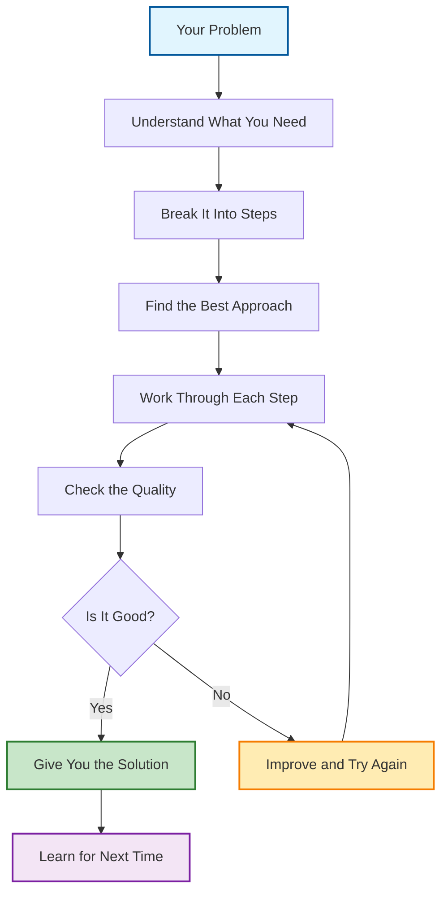

# GIOS: Goal-Integrated Operating System for Reasoning and Execution

[](https://github.com/Pratar/GIOS/releases)
[](https://www.gnu.org/licenses/gpl-3.0)
[](https://github.com/Pratar/GIOS)
[](https://github.com/Pratar/GIOS)

## Quick Start

**Just want to try it?** → [What is GIOS?](#what-is-gios) → [How to Use It](#how-to-use-gios) → [Examples](#examples)

**I need help with...**
- [Writing better documents](#writing-better-documents)
- [Making business decisions](#making-business-decisions) 
- [Planning projects](#planning-projects)
- [Solving problems step by step](#solving-problems-step-by-step)

## What is GIOS?

**GIOS is a simple method to solve any complex problem step by step.**

Think of it like a recipe for thinking. Just like a good recipe helps you cook a perfect meal, GIOS helps you "cook up" perfect solutions to any problem.

### What does GIOS do?
- **Breaks big problems into small steps** - like cutting a big task into bite-sized pieces
- **Makes sure you don't miss anything** - like a checklist that prevents mistakes
- **Helps you make better decisions** - like having a wise friend give you advice
- **Gets better with practice** - the more you use it, the better it works

### Real example:
Let's say you need to plan a birthday party:

1. **What do you want?** → A fun party for 20 people
2. **What do you need?** → Venue, food, decorations, invitations
3. **Check each thing** → Is the venue big enough? Is the food good?
4. **Make sure it all fits** → Do the decorations match the theme?
5. **Test your plan** → Will everyone have fun?
6. **Learn for next time** → What worked well? What could be better?

**Result:** A great party that everyone enjoys, and you know exactly how to plan the next one even better!

> **💡 Simple as that!** No complicated terms, no technical jargon - just a clear way to solve problems.

## How GIOS Organizes Information

GIOS uses a simple but powerful way to organize complex problems:

### Contexts (Rooms)
Think of contexts as different "rooms" where different types of problems are solved:
- **Planning room** - For project planning and scheduling
- **Writing room** - For documents and communication
- **Decision room** - For making choices and comparisons
- **Problem-solving room** - For analyzing and fixing issues

### Artifacts (Key Elements)
Each context contains important elements (artifacts) that need to be considered:
- **Requirements** - What needs to be accomplished
- **Constraints** - Limitations and boundaries
- **Resources** - What's available to work with
- **Stakeholders** - Who is involved and affected

### Policies (Decision Rules)
GIOS uses clear rules to make decisions:
- **If-then logic** - Clear conditions and actions
- **Priority systems** - What's most important
- **Quality gates** - What makes a solution acceptable
- **Learning rules** - How to improve over time

## How to Use GIOS

**GIOS works with AI assistants like ChatGPT, Claude, or Gemini.** Here's exactly how to use it:

### Step 1: Upload the GIOS file to your AI assistant
**First, you need to give the AI the GIOS instructions:**
- Download the file: `source/gios-ieee.tex` or `gios-ieee.pdf` from this repository
- Upload it to your AI assistant (ChatGPT, Claude, etc.)
- Or copy the text from the file and paste it into the chat

### Step 2: Tell the AI what you want
**Be specific about your goal.**
- "I need to plan a team meeting"
- "I want to write a better email to my boss" 
- "I need to choose between two job offers"

### Step 3: Give some background
**Share what you know already.**
- Any documents or information you have
- Your deadline or budget
- Who else is involved

### Step 4: Ask for the format you want
**Tell the AI how you want the answer.**
- "Give me a simple checklist"
- "Write it as an email I can send"
- "Make it 5 bullet points"

### Step 5: Add any special requirements
**Anything important to remember.**
- "Keep it simple, no jargon"
- "I need it by tomorrow"
- "Make it friendly and professional"

### Example of what to say to your AI:
```
"I uploaded the GIOS file. Please help me plan a company picnic for 50 people. 
Budget is $2000, date is next month. Give me a checklist with deadlines. 
Keep it simple and fun."
```

## How to Get Started (Step by Step)

### Option 1: Download and Upload (Recommended)
1. **Download the file:**
   - Click on `source/gios-ieee.tex` in this repository
   - Or download `gios-ieee.pdf` if you prefer PDF format
   
2. **Go to your AI assistant:**
   - ChatGPT: chat.openai.com
   - Claude: claude.ai
   - Gemini: gemini.google.com
   
3. **Upload the file:**
   - Look for the paperclip icon or "Upload" button
   - Select the GIOS file you downloaded
   - Wait for it to process

4. **Start using GIOS:**
   - Type your problem or question
   - The AI will use GIOS to help you solve it

### Option 2: Copy and Paste
1. **Open the file:**
   - Click on `source/gios-ieee.tex` in this repository
   - Select all text (Ctrl+A or Cmd+A)
   - Copy it (Ctrl+C or Cmd+C)

2. **Paste into your AI:**
   - Go to your AI assistant
   - Paste the text (Ctrl+V or Cmd+V)
   - Add your question after the pasted text

### What to do if it doesn't work:
- **File too big?** Try the PDF version instead
- **AI doesn't understand?** Try saying "Please use the GIOS method from the uploaded file"
- **Still confused?** Ask the AI: "Can you help me use the GIOS framework from the file I uploaded?"

---

## Examples

### Example 1: Planning a Project
**What you want:** "Plan a company picnic for 50 people"
**Background:** "Budget is $2000, date is next month, need to include food and activities"
**Format:** "Give me a checklist with deadlines"
**Requirements:** "Keep it simple and fun"

**GIOS gives you:** A step-by-step checklist with dates, tasks, and who's responsible for what.

### Example 2: Writing Better
**What you want:** "Rewrite this email to be more professional"
**Background:** "It's to a client about a delayed project"
**Format:** "Make it an email I can send directly"
**Requirements:** "Apologize but stay confident"

**GIOS gives you:** A polished, professional email that maintains your relationship while addressing the delay.

### Example 3: Making Decisions
**What you want:** "Help me choose between two job offers"
**Background:** "One pays more but longer commute, other is closer but less pay"
**Format:** "Give me pros and cons in a simple table"
**Requirements:** "Consider my family situation"

**GIOS gives you:** A clear comparison table showing all the important factors to help you decide.

### Example 4: Solving Personal Problems
**Problem:** "I need to decide whether to change jobs"
**GIOS helps by:**
- Looking at all the pros and cons
- Considering your family and finances
- Thinking about long-term goals
- Making sure you're being fair to yourself

**Result:** A thoughtful decision that feels right for you

## Quick Tips

✅ **Be specific** - "Plan a birthday party" is better than "Help me plan something"
✅ **Give context** - Share what you already know or have
✅ **Ask for format** - Tell us how you want the answer
✅ **Set boundaries** - Mention budget, time, or other limits
✅ **Keep it simple** - Don't overthink it, just ask!

> **💡 Remember:** There are no wrong questions. GIOS works for big problems and small ones, work tasks and personal decisions.

## How GIOS Works

**GIOS follows a simple 6-step process** that works for any problem:

### Step 1: Listen and Understand
GIOS pays attention to what you really need, not just what you say. It asks questions to make sure it gets it right.

### Step 2: Break It Down
Big problems get broken into smaller, manageable pieces. Like taking apart a puzzle to see all the pieces.

### Step 3: Find the Best Way
GIOS looks at your problem and picks the best method to solve it. Different problems need different approaches.

### Step 4: Work Through It
Step by step, GIOS follows the plan. It checks each part as it goes to make sure everything fits together.

### Step 5: Check the Quality
Before giving you the answer, GIOS makes sure it's actually good and solves your real problem.

### Step 6: Learn and Improve
GIOS remembers what worked and gets better at solving similar problems next time.

### Quality Testing
Every solution goes through systematic testing:

- **Completeness test** - Does it cover all important aspects?
- **Clarity test** - Is it easy to understand and follow?
- **Fairness test** - Does it work for everyone involved?
- **Efficiency test** - Is it the best use of resources?
- **Traceability test** - Can you explain every decision?

If any test fails, GIOS improves the solution and tests again.

**That's it!** Simple, reliable, and it gets better with practice.

> **💡 Think of it like:** Having a smart friend who's really good at solving problems, and who gets smarter every time you ask for help.

## Why Use GIOS?

**Because it makes solving problems easier and more reliable!**

### Built-in Quality Checks
Every GIOS solution includes automatic quality checks:

- **Completeness** - All important aspects covered
- **Clarity** - Easy to understand and follow
- **Fairness** - Works for everyone involved
- **Traceability** - You can explain every decision
- **Efficiency** - Best use of time and resources

### What makes GIOS special?
- **It's systematic** - No more guessing or hoping for the best
- **It's complete** - Makes sure you don't miss important details  
- **It's fair** - Considers everyone involved, not just one perspective
- **It learns** - Gets better each time you use it
- **It's reliable** - Works the same way every time

### Real benefits you'll see:
- **Save time** - No more going in circles or starting over
- **Better results** - More complete and thoughtful solutions
- **Less stress** - Clear steps instead of confusion
- **Build confidence** - Know you're doing it right
- **Learn faster** - Each problem teaches you something new

## Frequently Asked Questions

### Q: Do I need to be technical to use GIOS?
**A:** No! GIOS is designed for everyone. You just need to be able to upload a file to an AI assistant.

### Q: Which AI assistant works best with GIOS?
**A:** Any of them work great! ChatGPT, Claude, and Gemini all understand GIOS well.

### Q: What if I don't understand the technical file?
**A:** You don't need to understand it! Just upload it to your AI assistant and ask your question. The AI will use it for you.

### Q: Can I use GIOS without an AI assistant?
**A:** Yes, but it's much easier with AI. You can read the file and try to follow the steps yourself, but AI makes it much simpler.

### Q: Is GIOS free to use?
**A:** Yes! GIOS is completely free. You just need access to an AI assistant (some are free, some cost money).

### Q: What kinds of problems can GIOS solve?
**A:** Almost any problem! Planning, writing, decision-making, project management, personal problems - if you can think of it, GIOS can help.

### Q: How does GIOS get better over time?
**A:** GIOS learns from each solution and improves its approach while maintaining quality standards. It gets smarter without breaking what already works.

### Q: What if my problem is very complex?
**A:** That's exactly what GIOS is designed for! It breaks complex problems into manageable pieces and ensures all parts work together properly.

### Q: Can GIOS handle conflicting requirements?
**A:** Yes! GIOS specializes in finding solutions that satisfy all requirements without compromise.

## Technical Foundation (Simplified)

GIOS uses three key quality checks to ensure reliable solutions:

### Structural Integrity
- **Elemental rules** - Basic structural requirements are met
- **Bias prevention** - Solutions work fairly for all groups
- **Traceability** - Every decision can be explained and tracked
- **Dependency management** - All parts work together logically

### Complete Coverage
- **Domain coverage** - All relevant aspects are considered
- **Cluster cohesion** - Related elements are properly grouped
- **Growth control** - System doesn't become too complex
- **Link budgets** - Information flows efficiently

### Glossary Completeness
- **Clear terminology** - No ambiguous or confusing language
- **Complete catalog** - All concepts are properly defined
- **Bidirectional navigation** - Easy to find related information
- **Readability optimization** - Language is clear and accessible

## How GIOS Works - Visual Guide

Here's a simple diagram showing how GIOS solves problems:



**What each step does:**
- **Understand** - GIOS listens carefully to what you really need
- **Break Down** - Takes your big problem and makes it manageable
- **Find Approach** - Picks the best method for your specific situation
- **Work Through** - Follows the plan step by step
- **Check Quality** - Makes sure the solution actually works
- **Learn** - Gets smarter for next time

## Ready to Try GIOS?

**It's easier than you think!**

1. **Download the file** - Get `source/gios-ieee.tex` or `gios-ieee.pdf` from this page
2. **Upload to your AI** - ChatGPT, Claude, or Gemini - any of them work great
3. **Ask your question** - Just describe what you need help with
4. **Get your answer** - GIOS will give you a step-by-step solution

**That's it!** No complicated setup, no technical knowledge needed.

### Need Help?
- **Can't find the file?** Look for "source" folder in this repository
- **AI doesn't understand?** Try saying "Please use the GIOS method from the uploaded file"
- **Still stuck?** Ask the AI: "Can you help me use the GIOS framework?"

### Want to Learn More?
- **For developers**: Check out the technical documentation in the `source` folder
- **For researchers**: Read the full specification in `gios-ieee.tex`
- **For everyone**: Just start using it - you'll learn as you go!

---

**GIOS: Making complex problems simple, one step at a time.**
