<div align="center">

# 🧠 GIOS
## Goal-Integrated Operating System for Reasoning and Execution

*The Future of Intelligent Problem-Solving*

[](https://github.com/Pratar/GIOS/releases)
[](https://www.gnu.org/licenses/gpl-3.0)
[](https://github.com/Pratar/GIOS)
[](https://github.com/Pratar/GIOS)
[](https://github.com/Pratar/GIOS)

[](https://github.com/Pratar/GIOS/stargazers)
[](https://github.com/Pratar/GIOS/network/members)
[](https://github.com/Pratar/GIOS/issues)

</div>

---

## 🚀 Quick Navigation

<table>
<tr>
<td width="50%">

### 🎯 **I want to...**
- [**Get started quickly**](#-quick-start) - Jump right in
- [**Understand what GIOS is**](#-what-is-gios) - Core concepts
- [**See real examples**](#-examples) - Practical use cases
- [**Learn the method**](#-how-gios-works) - Step-by-step process

</td>
<td width="50%">

### 🔧 **I need help with...**
- [**Writing better documents**](#writing-better-documents) - Content creation
- [**Making business decisions**](#making-business-decisions) - Strategic thinking
- [**Planning projects**](#planning-projects) - Project management
- [**Solving complex problems**](#solving-problems-step-by-step) - Problem solving

</td>
</tr>
</table>

---

## ⚡ Quick Start

> **🎯 Goal**: Get GIOS working in 5 minutes

### Option 1: Download & Upload (Recommended)
1. **Download** the GIOS specification: [`source/gios-ieee.tex`](source/gios-ieee.tex) or [`gios-ieee.pdf`](gios-ieee.pdf)
2. **Upload** to your AI assistant (ChatGPT, Claude, etc.)
3. **Use** the instructions below

### Option 2: Copy & Paste
1. **Copy** the content from [`source/gios-ieee.tex`](source/gios-ieee.tex)
2. **Paste** into your AI assistant
3. **Follow** the instructions below

### 🎯 Ready-to-use request template:
```
Do: [what you need]
Data: [text/link/numbers]  
Format: [bullets/checklist/table/email ≤ N words]
Important: [criteria/constraints/deadline]
```

**Example:**
```
Do: Create a supplier negotiation plan
Data: email and prices below
Format: 10-step checklist
Important: ≥15% savings, polite tone, deadline tomorrow
```

## 🧠 What is GIOS?

<div align="center">

**GIOS is the future of intelligent problem-solving**  
*Think of it as a recipe for thinking that gets better with every use*

</div>

### 🎯 The Problem GIOS Solves

Traditional problem-solving approaches suffer from:
- **Fragmentation** - Different tools for different problems
- **Inconsistency** - No unified framework
- **Instability** - Systems break under complexity
- **Unpredictability** - Results become erratic

### ✨ How GIOS Works

```mermaid
graph LR
    A[🎯 Your Goal] --> B[📋 Break Down]
    B --> C[🔍 Check Quality]
    C --> D[✅ Execute]
    D --> E[📈 Learn & Improve]
    E --> A
```



### 🚀 Key Features

<table>
<tr>
<td width="33%">

#### 🎯 **Goal-Oriented**
- Every action serves a purpose
- Clear success criteria
- Measurable outcomes

</td>
<td width="33%">

#### 🏗️ **Systematic**
- Structured approach
- No missed steps
- Consistent results

</td>
<td width="33%">

#### 🔄 **Adaptive**
- Learns from experience
- Improves over time
- Handles complexity

</td>
</tr>
</table>

### 💡 Real-World Example

**Scenario:** Planning a birthday party

| Step | GIOS Process | Result |
|------|-------------|---------|
| 1️⃣ | **Define Goal** | "Fun party for 20 people" |
| 2️⃣ | **Break Down** | Venue, food, decorations, invitations |
| 3️⃣ | **Check Quality** | Is venue big enough? Food good? |
| 4️⃣ | **Ensure Fit** | Do decorations match theme? |
| 5️⃣ | **Test Plan** | Will everyone have fun? |
| 6️⃣ | **Learn** | What worked? What to improve? |

**Outcome:** 🎉 Perfect party + knowledge for next time!

> **💡 The Magic:** No technical jargon, no complicated terms - just a clear, powerful way to solve any problem.

## How GIOS Organizes Information

GIOS uses a simple but powerful way to organize complex problems:

### Contexts (Rooms)
Think of contexts as different "rooms" where different types of problems are solved:
- **Planning room** - For project planning and scheduling
- **Writing room** - For documents and communication
- **Decision room** - For making choices and comparisons
- **Problem-solving room** - For analyzing and fixing issues

### Artifacts (Key Elements)
Each context contains important elements (artifacts) that need to be considered:
- **Requirements** - What needs to be accomplished
- **Constraints** - Limitations and boundaries
- **Resources** - What's available to work with
- **Stakeholders** - Who is involved and affected

### Policies (Decision Rules)
GIOS uses clear rules to make decisions:
- **If-then logic** - Clear conditions and actions
- **Priority systems** - What's most important
- **Quality gates** - What makes a solution acceptable
- **Learning rules** - How to improve over time

## How to Use GIOS

**GIOS works with AI assistants like ChatGPT, Claude, or Gemini.** Here's exactly how to use it:

### Step 1: Upload the GIOS file to your AI assistant
**First, you need to give the AI the GIOS instructions:**
- Download the file: `source/gios-ieee.tex` or `gios-ieee.pdf` from this repository
- Upload it to your AI assistant (ChatGPT, Claude, etc.)
- Or copy the text from the file and paste it into the chat

### Step 2: Tell the AI what you want
**Be specific about your goal.**
- "I need to plan a team meeting"
- "I want to write a better email to my boss" 
- "I need to choose between two job offers"

### Step 3: Give some background
**Share what you know already.**
- Any documents or information you have
- Your deadline or budget
- Who else is involved

### Step 4: Ask for the format you want
**Tell the AI how you want the answer.**
- "Give me a simple checklist"
- "Write it as an email I can send"
- "Make it 5 bullet points"

### Step 5: Add any special requirements
**Anything important to remember.**
- "Keep it simple, no jargon"
- "I need it by tomorrow"
- "Make it friendly and professional"

### Example of what to say to your AI:
```
"I uploaded the GIOS file. Please help me plan a company picnic for 50 people. 
Budget is $2000, date is next month. Give me a checklist with deadlines. 
Keep it simple and fun."
```

## How to Get Started (Step by Step)

### Option 1: Download and Upload (Recommended)
1. **Download the file:**
   - Click on `source/gios-ieee.tex` in this repository
   - Or download `gios-ieee.pdf` if you prefer PDF format
   
2. **Go to your AI assistant:**
   - ChatGPT: chat.openai.com
   - Claude: claude.ai
   - Gemini: gemini.google.com
   
3. **Upload the file:**
   - Look for the paperclip icon or "Upload" button
   - Select the GIOS file you downloaded
   - Wait for it to process

4. **Start using GIOS:**
   - Type your problem or question
   - The AI will use GIOS to help you solve it

### Option 2: Copy and Paste
1. **Open the file:**
   - Click on `source/gios-ieee.tex` in this repository
   - Select all text (Ctrl+A or Cmd+A)
   - Copy it (Ctrl+C or Cmd+C)

2. **Paste into your AI:**
   - Go to your AI assistant
   - Paste the text (Ctrl+V or Cmd+V)
   - Add your question after the pasted text

### What to do if it doesn't work:
- **File too big?** Try the PDF version instead
- **AI doesn't understand?** Try saying "Please use the GIOS method from the uploaded file"
- **Still confused?** Ask the AI: "Can you help me use the GIOS framework from the file I uploaded?"

---

## Examples

### Example 1: Planning a Project
**What you want:** "Plan a company picnic for 50 people"
**Background:** "Budget is $2000, date is next month, need to include food and activities"
**Format:** "Give me a checklist with deadlines"
**Requirements:** "Keep it simple and fun"

**GIOS gives you:** A step-by-step checklist with dates, tasks, and who's responsible for what.

### Example 2: Writing Better
**What you want:** "Rewrite this email to be more professional"
**Background:** "It's to a client about a delayed project"
**Format:** "Make it an email I can send directly"
**Requirements:** "Apologize but stay confident"

**GIOS gives you:** A polished, professional email that maintains your relationship while addressing the delay.

### Example 3: Making Decisions
**What you want:** "Help me choose between two job offers"
**Background:** "One pays more but longer commute, other is closer but less pay"
**Format:** "Give me pros and cons in a simple table"
**Requirements:** "Consider my family situation"

**GIOS gives you:** A clear comparison table showing all the important factors to help you decide.

### Example 4: Solving Personal Problems
**Problem:** "I need to decide whether to change jobs"
**GIOS helps by:**
- Looking at all the pros and cons
- Considering your family and finances
- Thinking about long-term goals
- Making sure you're being fair to yourself

**Result:** A thoughtful decision that feels right for you

## Quick Tips

✅ **Be specific** - "Plan a birthday party" is better than "Help me plan something"
✅ **Give context** - Share what you already know or have
✅ **Ask for format** - Tell us how you want the answer
✅ **Set boundaries** - Mention budget, time, or other limits
✅ **Keep it simple** - Don't overthink it, just ask!

> **💡 Remember:** There are no wrong questions. GIOS works for big problems and small ones, work tasks and personal decisions.

## How GIOS Works

**GIOS follows a simple 6-step process** that works for any problem:

### Step 1: Listen and Understand
GIOS pays attention to what you really need, not just what you say. It asks questions to make sure it gets it right.

### Step 2: Break It Down
Big problems get broken into smaller, manageable pieces. Like taking apart a puzzle to see all the pieces.

### Step 3: Find the Best Way
GIOS looks at your problem and picks the best method to solve it. Different problems need different approaches.

### Step 4: Work Through It
Step by step, GIOS follows the plan. It checks each part as it goes to make sure everything fits together.

### Step 5: Check the Quality
Before giving you the answer, GIOS makes sure it's actually good and solves your real problem.

### Step 6: Learn and Improve
GIOS remembers what worked and gets better at solving similar problems next time.

### Quality Testing
Every solution goes through systematic testing:

- **Completeness test** - Does it cover all important aspects?
- **Clarity test** - Is it easy to understand and follow?
- **Fairness test** - Does it work for everyone involved?
- **Efficiency test** - Is it the best use of resources?
- **Traceability test** - Can you explain every decision?

If any test fails, GIOS improves the solution and tests again.

**That's it!** Simple, reliable, and it gets better with practice.

> **💡 Think of it like:** Having a smart friend who's really good at solving problems, and who gets smarter every time you ask for help.

## Why Use GIOS?

**Because it makes solving problems easier and more reliable!**

### Built-in Quality Checks
Every GIOS solution includes automatic quality checks:

- **Completeness** - All important aspects covered
- **Clarity** - Easy to understand and follow
- **Fairness** - Works for everyone involved
- **Traceability** - You can explain every decision
- **Efficiency** - Best use of time and resources

### What makes GIOS special?
- **It's systematic** - No more guessing or hoping for the best
- **It's complete** - Makes sure you don't miss important details  
- **It's fair** - Considers everyone involved, not just one perspective
- **It learns** - Gets better each time you use it
- **It's reliable** - Works the same way every time

### Real benefits you'll see:
- **Save time** - No more going in circles or starting over
- **Better results** - More complete and thoughtful solutions
- **Less stress** - Clear steps instead of confusion
- **Build confidence** - Know you're doing it right
- **Learn faster** - Each problem teaches you something new

## Frequently Asked Questions

### Q: Do I need to be technical to use GIOS?
**A:** No! GIOS is designed for everyone. You just need to be able to upload a file to an AI assistant.

### Q: Which AI assistant works best with GIOS?
**A:** Any of them work great! ChatGPT, Claude, and Gemini all understand GIOS well.

### Q: What if I don't understand the technical file?
**A:** You don't need to understand it! Just upload it to your AI assistant and ask your question. The AI will use it for you.

### Q: Can I use GIOS without an AI assistant?
**A:** Yes, but it's much easier with AI. You can read the file and try to follow the steps yourself, but AI makes it much simpler.

### Q: Is GIOS free to use?
**A:** Yes! GIOS is completely free. You just need access to an AI assistant (some are free, some cost money).

### Q: What kinds of problems can GIOS solve?
**A:** Almost any problem! Planning, writing, decision-making, project management, personal problems - if you can think of it, GIOS can help.

### Q: How does GIOS get better over time?
**A:** GIOS learns from each solution and improves its approach while maintaining quality standards. It gets smarter without breaking what already works.

### Q: What if my problem is very complex?
**A:** That's exactly what GIOS is designed for! It breaks complex problems into manageable pieces and ensures all parts work together properly.

### Q: Can GIOS handle conflicting requirements?
**A:** Yes! GIOS specializes in finding solutions that satisfy all requirements without compromise.

## Technical Foundation (Simplified)

GIOS uses three key quality checks to ensure reliable solutions:

### Structural Integrity
- **Elemental rules** - Basic structural requirements are met
- **Bias prevention** - Solutions work fairly for all groups
- **Traceability** - Every decision can be explained and tracked
- **Dependency management** - All parts work together logically

### Complete Coverage
- **Domain coverage** - All relevant aspects are considered
- **Cluster cohesion** - Related elements are properly grouped
- **Growth control** - System doesn't become too complex
- **Link budgets** - Information flows efficiently

### Glossary Completeness
- **Clear terminology** - No ambiguous or confusing language
- **Complete catalog** - All concepts are properly defined
- **Bidirectional navigation** - Easy to find related information
- **Readability optimization** - Language is clear and accessible

## ⚙️ How GIOS Works

<div align="center">

### 🎯 The GIOS Process in 6 Steps

```mermaid
graph TD
    A[🎯 Your Problem] --> B[📋 Understand What You Need]
    B --> C[🔨 Break It Into Steps]
    C --> D[🎯 Find the Best Approach]
    D --> E[⚡ Work Through Each Step]
    E --> F[🔍 Check the Quality]
    F --> G{✅ Is It Good?}
    G -->|Yes| H[🎉 Give You the Solution]
    G -->|No| I[🔄 Improve and Try Again]
    I --> E
    H --> J[📚 Learn for Next Time]
    
    style A fill:#e3f2fd,stroke:#1976d2,stroke-width:3px
    style H fill:#e8f5e8,stroke:#388e3c,stroke-width:3px
    style I fill:#fff3e0,stroke:#f57c00,stroke-width:3px
    style G fill:#f3e5f5,stroke:#7b1fa2,stroke-width:3px
```

</div>



### 🔄 The GIOS Cycle

<table>
<tr>
<td width="50%">

#### 🎯 **Phase 1: Goal Setting**
- Define what you want to achieve
- Set clear success criteria
- Identify constraints and requirements

#### 📋 **Phase 2: Analysis**
- Break down the problem
- Identify all components
- Map relationships and dependencies

</td>
<td width="50%">

#### 🔨 **Phase 3: Solution Design**
- Generate multiple approaches
- Evaluate trade-offs
- Select optimal strategy

#### ⚡ **Phase 4: Execution**
- Implement step by step
- Monitor progress
- Adjust as needed

</td>
</tr>
<tr>
<td width="50%">

#### 🔍 **Phase 5: Quality Check**
- Verify each component
- Test overall solution
- Measure against criteria

</td>
<td width="50%">

#### 📚 **Phase 6: Learning**
- Document what worked
- Identify improvements
- Update knowledge base

</td>
</tr>
</table>

**What each step does:**
- **Understand** - GIOS listens carefully to what you really need
- **Break Down** - Takes your big problem and makes it manageable
- **Find Approach** - Picks the best method for your specific situation
- **Work Through** - Follows the plan step by step
- **Check Quality** - Makes sure the solution actually works
- **Learn** - Gets smarter for next time

## 💡 Examples

<div align="center">

### 🎯 Real-World GIOS Applications

*See how GIOS solves problems across different domains*

</div>

### 📝 1. Writing Better Documents

<div align="center">

**🎯 Goal:** Create a compelling project proposal that gets approved

</div>

<table>
<tr>
<td width="50%">

#### 📋 **The Challenge**
- Don't know where to start
- Worried about missing key points
- Need to be persuasive and clear

</td>
<td width="50%">

#### ✨ **GIOS Solution**
1. **Define Goal** - Clear, persuasive proposal
2. **Break Down** - Introduction, problem, solution, timeline, budget
3. **Check Quality** - Is problem clear? Solution feasible?
4. **Ensure Fit** - Does budget match timeline?
5. **Test** - Would you approve this?
6. **Learn** - What made it successful?

</td>
</tr>
</table>

**🎉 Result:** A compelling proposal that clearly explains your idea and gets the green light.

---

### 💼 2. Making Business Decisions

<div align="center">

**🎯 Goal:** Choose the best supplier for maximum value

</div>

<table>
<tr>
<td width="50%">

#### 📋 **The Challenge**
- Two suppliers to choose from
- Multiple factors to consider
- Need to justify decision to team

</td>
<td width="50%">

#### ✨ **GIOS Solution**
1. **Define Goal** - Best value supplier
2. **Break Down** - Price, quality, delivery, reliability
3. **Check Quality** - How important is each factor?
4. **Ensure Fit** - Aligns with business goals?
5. **Test** - Will this help business grow?
6. **Learn** - What factors matter most?

</td>
</tr>
</table>

**🎉 Result:** A data-driven decision you can confidently explain to your team.

---

### 🚀 3. Planning Projects

<div align="center">

**🎯 Goal:** Deliver working software on time and within budget

</div>

<table>
<tr>
<td width="50%">

#### 📋 **The Challenge**
- Tight deadline
- Complex requirements
- Limited resources
- Need realistic timeline

</td>
<td width="50%">

#### ✨ **GIOS Solution**
1. **Define Goal** - On-time, on-budget delivery
2. **Break Down** - Features, tasks, resources, timeline
3. **Check Quality** - Are tasks realistic? Enough resources?
4. **Ensure Fit** - Does timeline match scope?
5. **Test** - Can you actually deliver in time?
6. **Learn** - What planning techniques worked?

</td>
</tr>
</table>

**🎉 Result:** A realistic project plan your team can follow and deliver successfully.

---

### 🧘 4. Solving Personal Problems

<div align="center">

**🎯 Goal:** Feel in control and productive again

</div>

<table>
<tr>
<td width="50%">

#### 📋 **The Challenge**
- Too many responsibilities
- Feeling overwhelmed
- Need better time management
- Want to reduce stress

</td>
<td width="50%">

#### ✨ **GIOS Solution**
1. **Define Goal** - Feel in control and productive
2. **Break Down** - List responsibilities, prioritize, delegate
3. **Check Quality** - Which tasks are important? What can be delegated?
4. **Ensure Fit** - Does schedule match energy levels?
5. **Test** - Do you feel less overwhelmed?
6. **Learn** - What strategies work best?

</td>
</tr>
</table>

**🎉 Result:** A clear action plan that reduces stress and increases productivity.

---

## 🚀 Ready to Try GIOS?

<div align="center">

### **It's easier than you think!**

</div>

<table>
<tr>
<td width="50%">

#### 📥 **Step 1: Download**
Get the GIOS specification:
- [`source/gios-ieee.tex`](source/gios-ieee.tex) (LaTeX)
- [`gios-ieee.pdf`](gios-ieee.pdf) (PDF)

</td>
<td width="50%">

#### 🤖 **Step 2: Upload**
Upload to your AI assistant:
- ChatGPT
- Claude
- Gemini
- Any AI that accepts files

</td>
</tr>
<tr>
<td width="50%">

#### 💬 **Step 3: Ask**
Describe what you need help with:
- "Help me plan a project"
- "I need to make a decision"
- "How do I solve this problem?"

</td>
<td width="50%">

#### ✨ **Step 4: Get Results**
GIOS will give you:
- Step-by-step solution
- Clear action plan
- Quality checks
- Learning insights

</td>
</tr>
</table>

> **💡 That's it!** No complicated setup, no technical knowledge needed.

### ❓ Need Help?

<table>
<tr>
<td width="50%">

#### 🔍 **Common Issues**
- **Can't find the file?** Look for "source" folder in this repository
- **AI doesn't understand?** Try: "Please use the GIOS method from the uploaded file"
- **Still stuck?** Ask: "Can you help me use the GIOS framework?"

</td>
<td width="50%">

#### 📚 **Learn More**
- **For developers**: Check out [`GIOS_Technical_Architecture.md`](GIOS_Technical_Architecture.md)
- **For researchers**: Read the full specification in [`source/gios-ieee.tex`](source/gios-ieee.tex)
- **For everyone**: Just start using it - you'll learn as you go!

</td>
</tr>
</table>

---

## ❓ Frequently Asked Questions

<div align="center">

### 🤔 **Common Questions About GIOS**

</div>

<table>
<tr>
<td width="50%">

#### **Q: Is GIOS free to use?**
**A:** Yes! GIOS is open-source and free under GPL v3 license.

#### **Q: Do I need technical knowledge?**
**A:** No! GIOS is designed for everyone - no technical background required.

#### **Q: Which AI assistants work with GIOS?**
**A:** Any AI that accepts file uploads: ChatGPT, Claude, Gemini, and more.

</td>
<td width="50%">

#### **Q: How does GIOS get better over time?**
**A:** GIOS learns from each problem it solves, improving its solutions over time.

#### **Q: Can I use GIOS for personal problems?**
**A:** Absolutely! GIOS works for any problem - personal, business, or technical.

#### **Q: Is there a mobile app?**
**A:** Not yet, but you can use GIOS through any AI assistant on your phone.

</td>
</tr>
</table>

---

## 🏆 Why Choose GIOS?

<div align="center">

### **The Future of Problem-Solving is Here**

</div>

<table>
<tr>
<td width="33%">

#### 🎯 **Goal-Oriented**
- Every action has a purpose
- Clear success criteria
- Measurable outcomes

#### 🏗️ **Systematic**
- Structured approach
- No missed steps
- Consistent results

</td>
<td width="33%">

#### 🔄 **Adaptive**
- Learns from experience
- Improves over time
- Handles complexity

#### 🛡️ **Reliable**
- Quality checks built-in
- Error prevention
- Safe operation

</td>
<td width="33%">

#### 🚀 **Scalable**
- Works for any problem size
- Grows with your needs
- Handles complexity

#### 🧠 **Intelligent**
- AI-powered insights
- Smart recommendations
- Continuous learning

</td>
</tr>
</table>

---

<div align="center">

## 🌟 **GIOS: Making Complex Problems Simple, One Step at a Time**

*The future of intelligent problem-solving starts here*

[](https://github.com/Pratar/GIOS/stargazers)
[](https://github.com/Pratar/GIOS/network/members)
[](https://github.com/Pratar/GIOS/issues)

**Ready to transform how you solve problems?** [Get started now!](#-quick-start)

</div>
